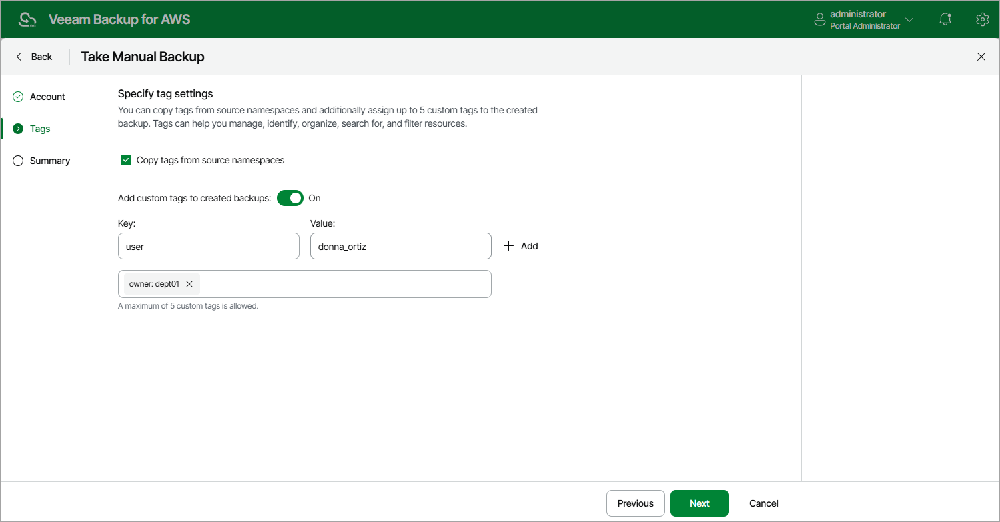

In this article

Veeam Backup for AWS allows you to manually create backups of Redshift Serverless namespaces. You can instruct Veeam Backup for AWS to store the created backups only in the same AWS Regions where the processed Redshift Serverless namespaces reside.

|  |
| --- |
| Note |
| Veeam Backup for AWS does not include backups created manually in the backup chain and does not apply the configured retention policy settings to these backups. This means that the backups are kept in your AWS environment unless you remove them manually, as described in section [Managing Backed-Up Redshift Serverless Data](backups_view_redshift_serverless.md). |

To manually create a backup of a Redshift Serverless namespace, do the following:

1. Navigate to Resources > Databases > Redshift Serverless.
2. Select the necessary namespace and click Take Backup Now.

For a Redshift Serverless namespace to be displayed in the list of available namespaces, an AWS Region where the namespace resides must be added to any of [configured Redshift Serverless backup policies](add_policy_source_settings_redshift_serverless.md), and the IAM role specified in the backup policy settings or in the organization settings must have permissions to access the namespace. For more information on the required permissions, see [Redshift Serverless Backup IAM Role Permissions](role_permissions_backup_redshift_serverless.md).

|  |
| --- |
| Important |
| Veeam Backup for AWS does not support taking manual backup of multiple namespaces that belong to different AWS accounts. |

1. Complete the Take Manual Backup wizard:

1. At the Account step of the wizard, specify an IAM role whose permissions Veeam Backup for AWS will use to create the backup. The specified IAM role must belong to the same AWS account to which the processed Redshift Serverless namespaces reside.

For an IAM role to be displayed in the list of available roles, it must be added to Veeam Backup for AWS as described in section [Adding IAM Roles](iam_roles_add.md).

|  |
| --- |
| Important |
| Veeam Backup for AWS does not support taking manual backup using IAM roles specified in the [organization settings](organization_add_settings.md). |

1. At the Tags step of the wizard, choose whether you want to assign AWS tags to the created backup.

* To assign already existing AWS tags from the processed namespace, select the Copy tags from source namespaces check box.

If you choose to copy tags from source namespace, Veeam Backup for AWS will first create a backup of the Redshift Serverless namespace and assign to the created backup AWS tags with Veeam metadata, then Veeam Backup for AWS will copy tags from the processed namespace and, finally, assign the copied AWS tags to the backup.

* To assign your own custom AWS tags, set the Add custom tags to created backup toggle to On and specify the tags explicitly. To do that, use the Key and Value fields to specify a key and a value for the new custom AWS tag, and then click Add. Note that you cannot add more than 5 custom AWS tags.

If you choose to add custom tags to created backups, Veeam Backup for AWS will assign the specified tags right after it creates a backup.

1. At the Summary step of the wizard, review configuration information, choose whether you want to proceed to the [Session Log page](reporting.md#ui) to track the progress of backup creation, and click Finish.

Page updated 9/23/2025

Page content applies to build 10.0.0.232
