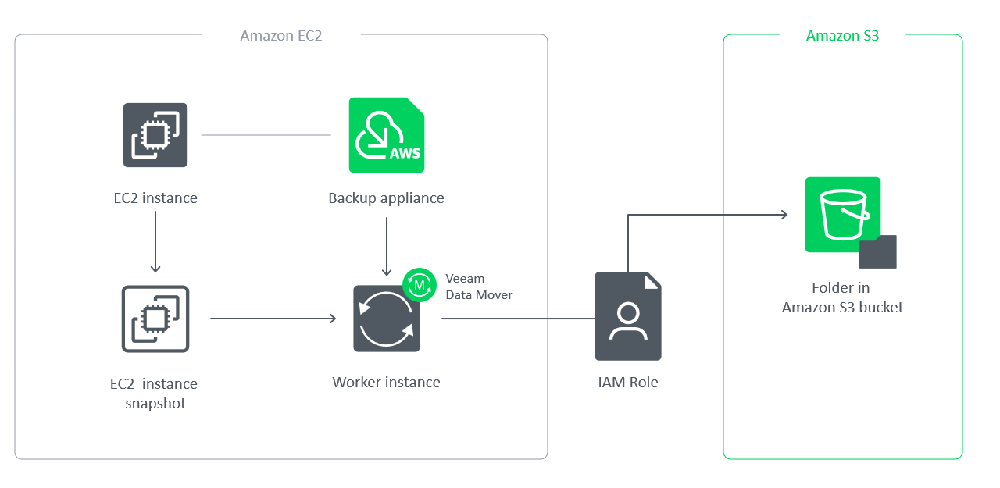

In this article

A backup repository is a folder in an Amazon S3 bucket where Veeam Backup for AWS stores EC2 and RDS image-level backups, additional copies of Amazon VPC backups, indexes of EFS file systems and configuration backups of standalone backup appliances.

To communicate with backup repositories, Veeam Backup for AWS uses Veeam Data Mover — a service that runs on a [worker instance](worker_instances.md) and that is responsible for data processing and transfer. When a backup policy addresses a backup repository, Veeam Data Mover establishes a connection with the repository to enable data transfer. To learn how Veeam Backup for AWS communicates with backup repositories, see [Managing Backup Repositories](repositories.md).

|  |
| --- |
| Important |
| Backup files are stored in backup repositories in the native Veeam format and must be modified neither manually nor by 3rd party tools. Otherwise, Veeam Backup for AWS may fail to restore the backed-up data. |

Encryption on Backup Repositories

For enhanced data security, Veeam Backup for AWS allows you to enable encryption at the repository level. Veeam Backup for AWS encrypts backup files stored in backup repositories the same way as Veeam Backup & Replication encrypts backup files stored in backup repositories. To learn what algorithms Veeam Backup & Replication uses to encrypt backup files, see the Veeam Backup & Replication User Guide, section [Data Encryption](https://helpcenter.veeam.com/docs/vbr/userguide/data_encryption.html?ver=13). To learn how to enable encryption at the repository level, see [Adding Backup Repositories](repositories_add_encryption.md).

Veeam Backup for AWS also supports scenarios where data is backed up to S3 buckets with enabled Amazon S3 default encryption. You can add the S3 bucket to the backup infrastructure and use it as a target location for image-level backups. For information on Amazon S3 default encryption, see [AWS Documentation](https://docs.aws.amazon.com/AmazonS3/latest/user-guide/default-bucket-encryption.html).

Page updated 8/8/2025

Page content applies to build 10.0.0.232
