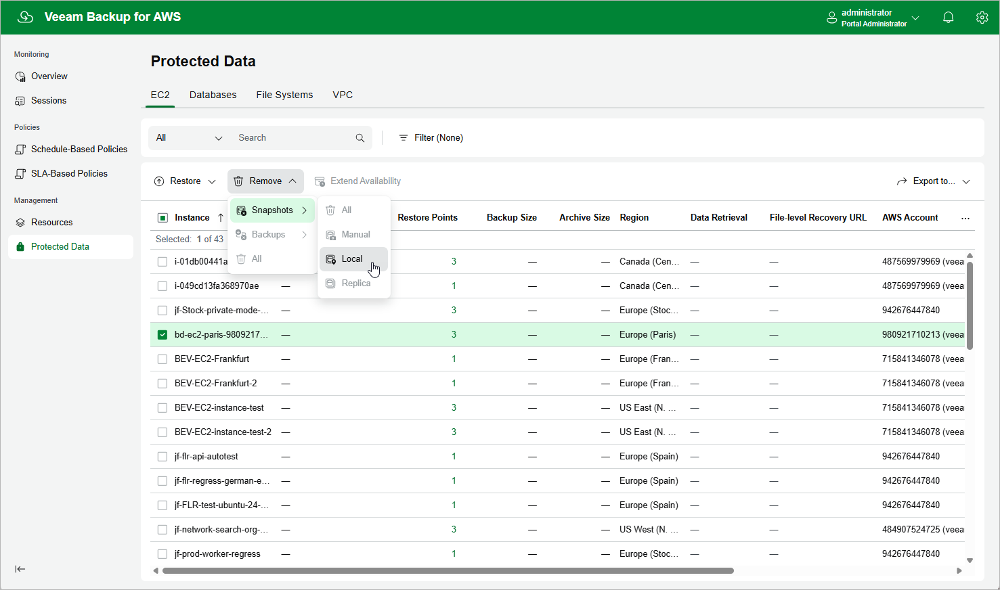

In this article

Veeam Backup for AWS applies the [configured retention policy settings](add_policy_schedule_retention.md) to automatically remove cloud-native snapshots, snapshot replicas and image-level backups created by backup policies. If necessary, you can also remove the backed-up data manually.

|  |
| --- |
| Important |
| Do not delete backup files from Amazon S3 buckets in the AWS Management Console. If some file in a backup chain is missing, you will not be able to roll back EC2 instance data to the necessary state. |

To remove backed-up data manually, do the following:

1. Navigate to Protected Data > EC2.
2. Select EC2 instances whose data you want to remove.
3. Click Remove and select either of the following options:

* Snapshots > All — to remove all cloud-native snapshots and snapshot replicas created for the selected EC2 instances both by backup policies and manually.
* Snapshots > Manual — to remove cloud-native snapshots created for the selected EC2 instances manually.

If you want to remove only specific cloud-native snapshots, follow the instructions provided in section [Removing Snapshots Created Manually](backups_remove_manual_snapshots.md).

* Snapshots > Local — to remove cloud-native snapshots created for the selected EC2 instances by backup policies.
* Snapshots > Replica — to remove snapshot replicas created for the selected EC2 instances by backup policies.
* Backups > All — to remove all backups created for the selected EC2 instances.
* Backups > Standard — to remove all standard backups created for the selected EC2 instances.
* Backups > Archived — to remove all archived backups created for the selected EC2 instances.

* All — to remove all cloud-native snapshots, snapshot replicas, and image-level backups created for the selected EC2 instances both by backup policies and manually.

Page updated 9/16/2025

Page content applies to build 10.0.0.232
