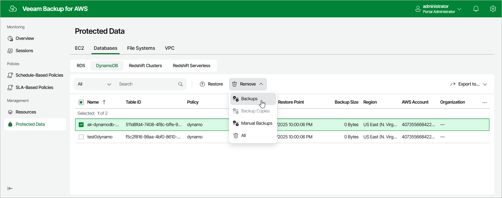

In this article

Veeam Backup for AWS applies the [configured retention policy settings](add_policy_schedule_retention_dynamo.md) to automatically remove DynamoDB backups and backup copies created by backup policies. If necessary, you can also remove the backed-up data manually.

To remove backed-up data manually, do the following:

1. Navigate to Protected Data > Databases > DynamoDB.
2. Select DynamoDB table whose data you want to remove.
3. Click Remove and select either of the following options:

* Backups — to remove DynamoDB backups created for the selected table by backup policies.
* Backup Copies — to remove backup copies created for the selected table by backup policies.
* Manual Backups — to remove DynamoDB backups created for the selected table manually.

If you want to remove only specific manual backup, follow the instructions provided in section [Removing DynamoDB Backups Created Manually](backups_remove_individual_dynamo.md).

* All — to remove all backups and backup copies created for the selected tables both by backup policies and manually.

Page updated 9/26/2025

Page content applies to build 10.0.0.232
