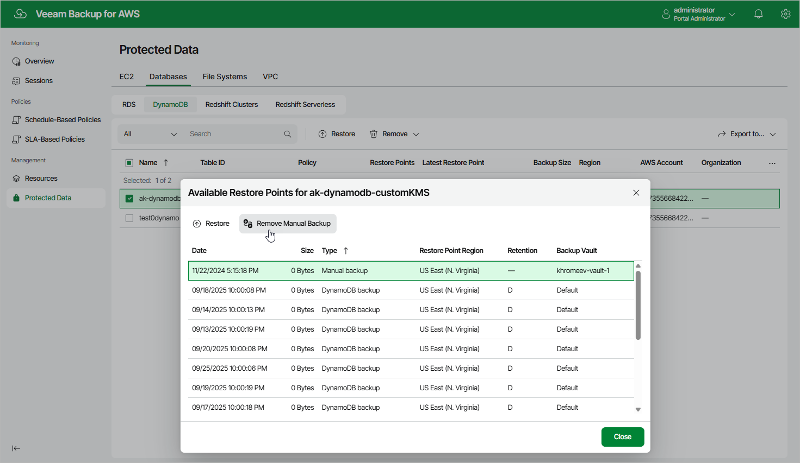

In this article

To remove all backups created for a DynamoDB table manually, follow the instructions provided in the [Removing DynamoDB Backups](backups_remove_dynamo.md) section. If you want to remove a specific DynamoDB backup created manually, do the following:

1. Navigate to Protected Data > Databases > DynamoDB.
2. Select the necessary table, and click the link in the Restore Points column.
3. In the Available Restore Points window, select a backup that you want to remove, and click Remove Manual Backup.

Related Topics

* [Creating DynamoDB Backups Manually](backup_manual_dynamo.md)
* [Removing DynamoDB Backups](backups_remove_dynamo.md)

Page updated 9/26/2025

Page content applies to build 10.0.0.232
