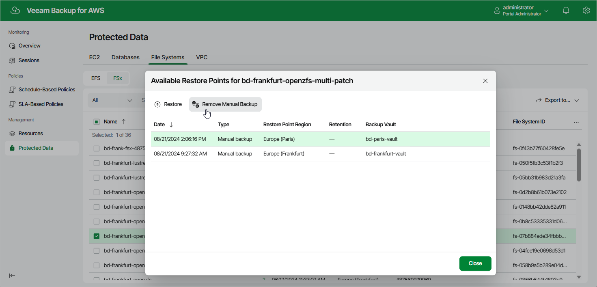

In this article

To remove all backups created for an FSx file system manually, follow the instructions provided in the [Removing FSx Backups](backups_remove_fsx.md) section. If you want to remove a specific FSx backup created manually, do the following:

1. Navigate to Protected Data > File Systems > FSx.
2. Select the necessary file system, and click the link in the Restore Points column.
3. In the Available Restore Points window, select a backup that you want to remove, and click Remove Manual Backup.

Related Topics

* [Creating FSx Backups Manually](backup_manual_fsx.md)
* [Removing FSx Backups](backups_remove_fsx.md)

Page updated 9/26/2025

Page content applies to build 10.0.0.232
