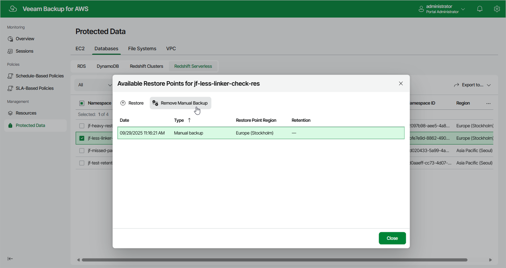

In this article

To remove all cloud-native backups created for a Redshift Serverless namespace manually, follow the instructions provided in the [Removing Redshift Serverless Backups](backups_remove_redshift_serverless.md) section. If you want to remove a specific backups created manually, do the following:

1. Navigate to Protected Data > Databases > Redshift Serverless.
2. Select the necessary namespace, and click the link in the Restore Points column.
3. In the Available Restore Points window, select a backup that you want to remove, and click Remove Manual Backup.

Related Topics

* [Creating Redshift Serverless Backups Manually](backup_manual_redshift_serverless.md)
* [Removing Redshift Serverless Backups](backups_remove_redshift_serverless.md)

Page updated 9/29/2025

Page content applies to build 10.0.0.232
