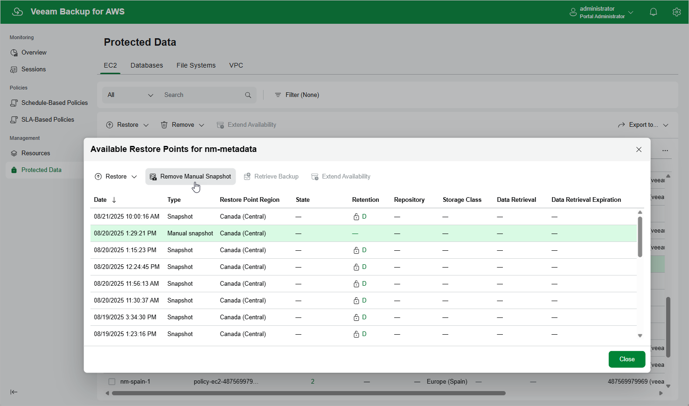

In this article

To remove all cloud-native snapshots created for an EC2 instance manually, follow the instructions provided in the [Removing EC2 Backups and Snapshots](backups_remove.md) section. If you want to remove a specific snapshot created manually, do the following:

1. Navigate to Protected Data > EC2.
2. Select the necessary instance, and click the link in the Restore Points column.
3. In the Available Restore Points window, select a snapshot that you want to remove, and click Remove Manual Snapshot.

Related Topics

* [Creating EC2 Snapshots Manually](snapshot_manual.md)
* [Removing EC2 Backups and Snapshots](backups_remove.md)

Page updated 9/16/2025

Page content applies to build 10.0.0.232
