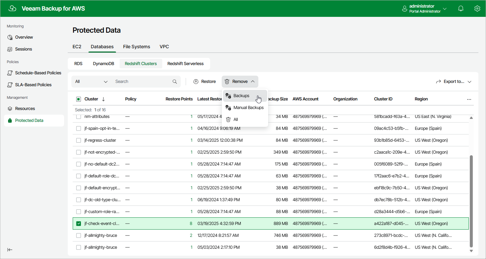

In this article

Veeam Backup for AWS applies the [configured retention policy settings](add_policy_schedule_retention_redshift.md) to automatically remove Redshift backups created by backup policies. If necessary, you can also remove the backed-up data manually.

To remove backed-up data manually, do the following:

1. Navigate to Protected Data > Databases > Redshift.
2. Select Redshift cluster whose data you want to remove.
3. Click Remove and select either of the following options:

* Backups — to remove Redshift backups created for the selected cluster by backup policies.
* Manual Backups — to remove Redshift backups created for the selected cluster manually.

If you want to remove only specific manual backup, follow the instructions provided in section [Removing Redshift Backups Created Manually](backups_remove_individual_redshift.md).

* All — to remove all backups created for the selected clusters both by backup policies and manually.

Page updated 9/26/2025

Page content applies to build 10.0.0.232
