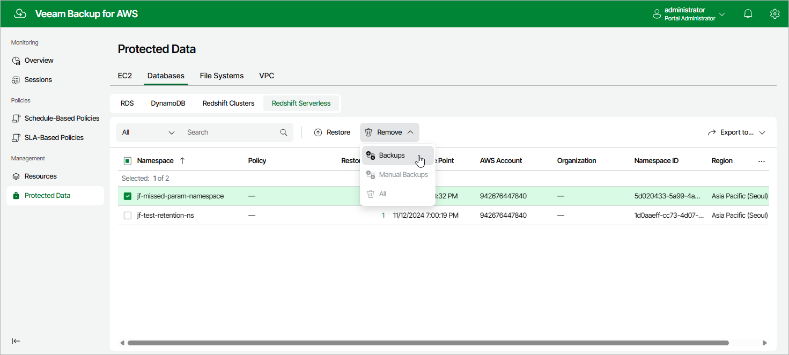

In this article

Veeam Backup for AWS applies the [configured retention policy settings](add_policy_schedule_retention_redshift_serverless.md) to automatically remove cloud-native backups created by backup policies. If necessary, you can also remove the backed-up data manually.

To remove backed-up data manually, do the following:

1. Navigate to Protected Data > Databases > Redshift Serverless.
2. Select Redshift Serverless namespace whose data you want to remove.
3. Click Remove and select either of the following options:

* Backups — to remove cloud-native backups created for the selected Redshift Serverless namespace by backup policies.
* Manual Backups — to remove cloud-native backups created for the selected Redshift Serverless namespace manually.

If you want to remove only specific manual cloud-native backups, follow the instructions provided in section [Removing Redshift Serverless Backups Created Manually](backups_remove_individual_redshift_serverless.md).

* All — to remove all cloud-native backups created for the selected Redshift Serverless namespaces both by backup policies and manually.

Page updated 9/26/2025

Page content applies to build 10.0.0.232
