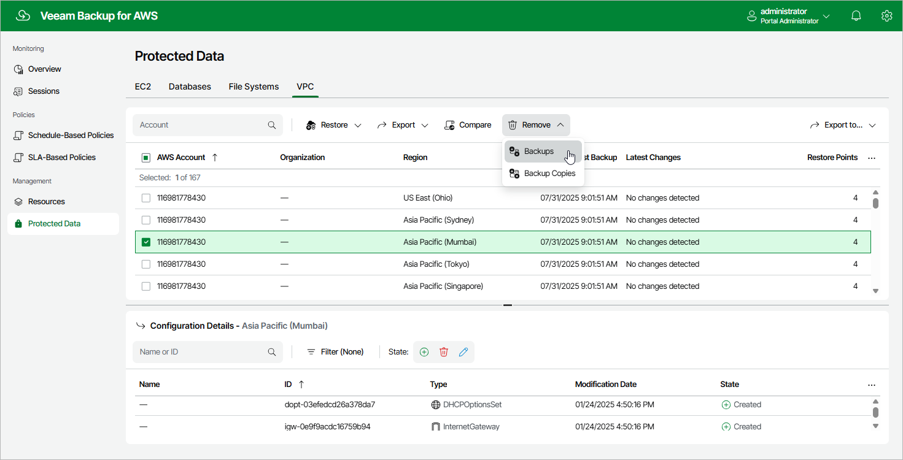

In this article

Veeam Backup for AWS applies the [configured retention policy settings](vpc_policy_retention.md) to automatically remove VPC configuration backups and backup copies created by the VPC Configuration Backup policy. If necessary, you can also remove these backups manually — from the configuration database or from the repository. Keep in mind, that:

* If a backup is removed from the repository but still exists in the configuration database, you will be able to use this backup to restore the VPC configuration data.
* If a backup is removed from the configuration database but still exists in the repository, you will be able to use this backup to restore the VPC configuration data — but you will first have re-add the backup repository to Veeam Backup for AWS as described in section [Adding Backup Repositories Using Web UI](repositories_add_ui.md).

To remove backed-up data manually, do the following:

1. Navigate to Protected Data > VPC.
2. Select the configuration record for which you want to remove the backed-up data.

Each configuration record contains a whole set of all virtual network configuration backups created for an AWS account and an AWS Region. Note that you cannot remove individual virtual network configuration items or specific backups.

1. Click Remove and select either of the following options:

* Backups — to remove all VPC configuration backups for the selected configuration record from the Veeam Backup for AWS database.
* Backup Copies — to remove all VPC configuration backups of all AWS Regions within selected AWS account from the backup repository specified in the [target settings](vpc_policy_add_copy.md) of the VPC Configuration Backup policy.

Page updated 9/26/2025

Page content applies to build 10.0.0.232
