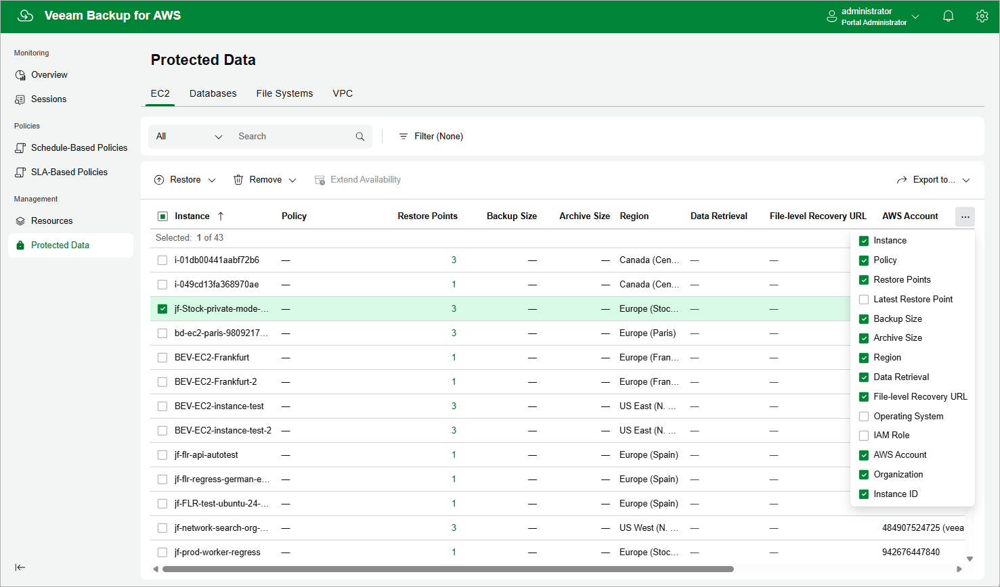

In this article

After a backup policy successfully creates a restore point of an EC2 instance according to the specified schedule, or after you create a snapshot of an EC2 instance manually, Veeam Backup for AWS adds the instance to the resource list on the Protected Data page.

For each backed-up EC2 instance, Veeam Backup for AWS creates a record in the configuration database with the following set of properties:

* Instance — the name of the EC2 instance.
* Policy — the name of the backup policy that processed the EC2 instance.
* Restore Points — the number of restore points created for the EC2 instance.

To view the list of restore points, click the link in the Restore Points column. The Available Restore Points window will display information on each restore point, including the following: the date when the restore point was created, the type of the restore point, the region where the restore point is stored, the state of the restore point (for image-level backups), the name and storage class of the backup repository where the restore point is stored, and the configured retention policy settings (D — daily, W — weekly, M — monthly or Y — yearly).

* Latest Restore Point — the date and time of the latest restore point that was created for the EC2 instance.

* Backup Size — the size of all backups created for the selected EC2 instance stored in standard repositories.
* Archive size — the size of all backups created for the selected EC2 instance stored in archive backup repositories.

* Region — the AWS Region in which the EC2 instance resides.
* Data Retrieval — shows whether any of the archived restore points of the EC2 instance is retrieved.
* File-level Recovery URL — a link to the file-level recovery browser.

The link appears when the file-level recovery session is started for the selected EC2 instance. The link contains a DNS name of the worker instance hosting the file-level recovery browser and authentication information used to access this worker instance.

* Operating System — the operating system running on the EC2 instance.
* IAM Role — the IAM role used to back up the EC2 instance.
* AWS Account — the AWS account to which the EC2 instance belongs.
* Organization — the AWS Organization to which the EC2 instance belongs.
* Instance ID — the AWS ID of the EC2 instance.

On the Protected Data page, you can also perform the following actions:

* Remove restore points if you no longer need them. For more information, see sections [Removing EC2 Backups and Snapshots](backups_remove.md) and [Removing EC2 Snapshots Created Manually](backups_remove_manual_snapshots.md).
* Retrieve image-level backups stored in archive backup repositories. For more information, see [Retrieving EC2 Data From Archive](data_retrieval.md).
* Restore data of backed-up EC2 instances. For more information, see [EC2 Restore Using Web UI](ec2_restore_ui.md).

Page updated 9/29/2025

Page content applies to build 10.0.0.232
