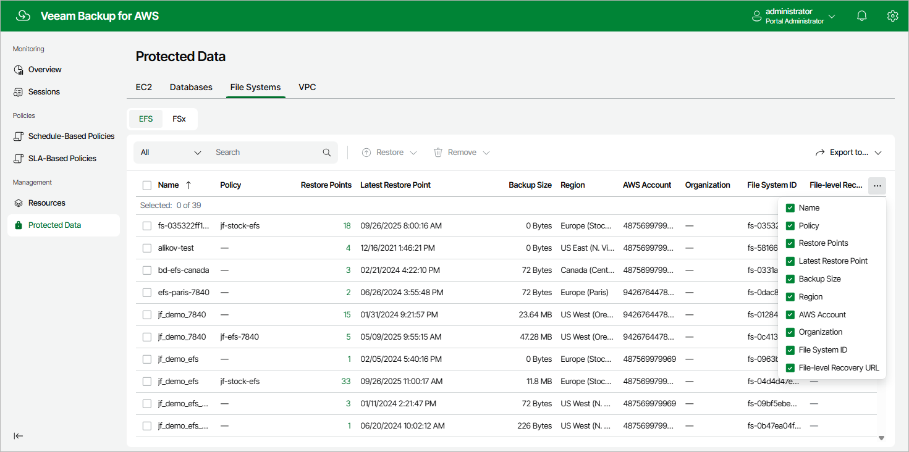

In this article

After a backup policy successfully creates a restore point of an EFS file system according to the specified schedule, or after you create a backup of an EFS file system manually, Veeam Backup for AWS adds the file system to the resource list on the Protected Data page.

For each backed-up EFS file system, Veeam Backup for AWS creates a record in the configuration database with the following set of properties:

* Name — the name of the EFS file system.
* Policy — the name of the backup policy that processed the EFS file system.
* Restore Points — the number of restore points created for the EFS file system.

To view the list of restore points, click the link in the Restore Points column. The Available Restore Points window will display information on each restore point, including the following: the date when the restore point was created, the size and type of the restore point, the backup vault where the restore point is stored, and the configured retention policy settings (D — daily, W — weekly, M — monthly or Y — yearly).

* Latest Restore Point — the date and time of the latest restore point that was created for the EFS file system.
* Backup Size —  the size of all backups created for the EFS file system.
* Region — the AWS Region in which the EFS file system resides.

* AWS Account — the AWS account to which the EFS file system belong.

* Organization — the AWS Organization to which the EFS file system belongs.

* File System ID — the AWS ID of the EFS file system.

* File-level Recovery URL — a link to the file-level recovery browser.

The link appears when the restore session is started for the file-level recovery process. The link contains a public DNS name or an IP address of the backup appliance hosting the file-level recovery browser and authentication information used to access the appliance.

On the Protected Data page, you can also perform the following actions:

* Remove restore points if you no longer need them. For more information, see sections [Removing EFS Backups](backups_remove_efs.md) and [Removing EFS Backups Created Manually](backups_remove_individual_efs.md).
* Restore data of backed-up EFS file system. For more information, see [EFS Restore Using Web UI](efs_restore_ui.md).

Page updated 9/26/2025

Page content applies to build 10.0.0.232
