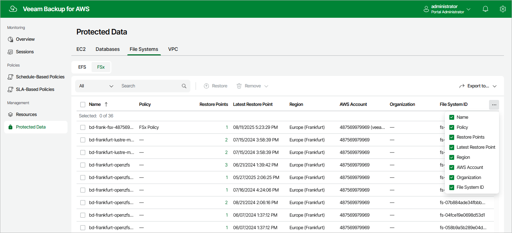

In this article

After a backup policy successfully creates a restore point of an FSx file system according to the specified schedule, or after you create a backup of an FSx file system manually, Veeam Backup for AWS adds the file system to the resource list on the Protected Data page.

For each backed-up FSx file system, Veeam Backup for AWS creates a record in the configuration database with the following set of properties:

* Name — the name of the FSx file system.
* Policy — the name of the backup policy that processed the FSx file system.
* Restore Points — the number of restore points created for the FSx file system.

To view the list of restore points, click the link in the Restore Points column. The Available Restore Points window will display information on each restore point, including the following: the date when the restore point was created, the size and type of the restore point, the backup vault where the restore point is stored, and the configured retention policy settings (D — daily, W — weekly, M — monthly or Y — yearly).

* Latest Restore Point — the date and time of the latest restore point that was created for the FSx file system.
* Region — the AWS Region in which the FSx file system resides.

* AWS Account — the AWS account to which the FSx file system belong.

* Organization — the AWS Organization to which the FSx file system belongs.

* File System ID — the AWS ID of the FSx file system.

On the Protected Data page, you can also perform the following actions:

* Remove restore points if you no longer need them. For more information, see sections [Removing FSx Backups](backups_remove_fsx.md) and [Removing FSx Backups Created Manually](backups_remove_individual_fsx.md).
* Restore data of backed-up FSx file system. For more information, see [FSx Restore Using Web UI](fsx_restore_ui.md).

Page updated 9/26/2025

Page content applies to build 10.0.0.232
