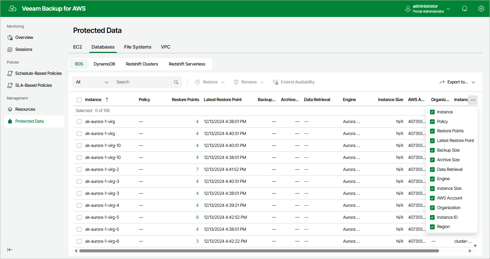

In this article

After a backup policy successfully creates a restore point of an RDS resource according to the specified schedule, or after you create a snapshot of an RDS resource manually, Veeam Backup for AWS adds the resource to the resource list on the Protected Data page.

For each backed-up RDS resource, Veeam Backup for AWS creates a record in the configuration database with the following set of properties:

* Instance — the name of the DB instance or Aurora DB cluster.
* Policy — the name of the backup policy that processed the DB instance or Aurora DB cluster.
* Restore Points — the number of restore points created for the DB instance or Aurora DB cluster.

To view the list of restore points, click the link in the Restore Points column. The Available Restore Points window will display information on each restore point, including the following: the date when the restore point was created, the type of the restore point, the region where the restore point is stored, the state of the restore point (for image-level backups), the name and storage class of the backup repository where the restore point is stored, and the configured retention policy settings (D — daily, W — weekly, M — monthly or Y — yearly).

* Latest Restore Point — the date and time of the latest restore point that was created for the DB instance or Aurora DB cluster.
* Backup Size — the size of all backups created for the Microsoft SQL Server and PostgreSQL DB instance stored in standard backup repositories.
* Archive size — the size of all backups created for the PostgreSQL DB instance stored in archive backup repositories.

* Engine — a database engine of the DB instance or Aurora DB cluster.

* Instance Size — the size of the DB instance storage.

* AWS Account — the AWS account to which the DB instance or Aurora DB cluster belongs.

* Organization — the AWS Organization to which the DB instance or Aurora DB cluster belongs.

* Instance ID — the AWS ID of the DB instance or Aurora DB cluster.

* Region — the AWS Region in which the DB instance or Aurora DB cluster resides.

On the Protected Data page, you can also perform the following actions:

* Remove restore points if you no longer need them. For more information, see sections [Removing RDS Backups and Snapshots](snapshots_remove_rds.md) and [Removing RDS Snapshots Created Manually](snapshots_remove_individual_rds.md).
* Restore data of backed-up RDS resources. For more information, see [RDS Restore Using Web UI](rds_restore_ui.md).

Page updated 12/11/2025

Page content applies to build 10.0.0.232
