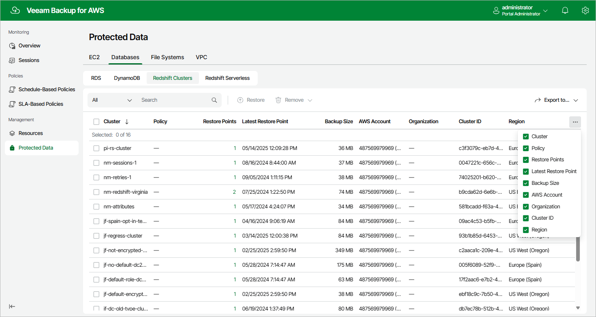

In this article

After a backup policy successfully creates a restore point of a Redshift cluster according to the specified schedule, or after you create a backup of a Redshift cluster manually, Veeam Backup for AWS adds the cluster to the resource list on the Protected Data page.

For each backed-up Redshift cluster, Veeam Backup for AWS creates a record in the configuration database with the following set of properties:

* Cluster — the name of the Redshift cluster.
* Policy — the name of the backup policy that processed the Redshift cluster.
* Restore Points — the number of restore points created for the Redshift cluster.

To view the list of restore points, click the link in the Restore Points column. The Available Restore Points window will display information on each restore point, including the following: the date when the restore point was created, the size and type of the restore point, the backup vault where the restore point is stored, and the configured retention policy settings (D — daily, W — weekly, M — monthly or Y — yearly).

* Latest Restore Point — the date and time of the latest restore point that was created for the Redshift cluster.

* Backup Size — the size of all backups created for the Redshift cluster stored in backup vaults.

* Cluster ID — the AWS ID of the Redshift cluster.

* AWS Account — the AWS account to which the Redshift cluster belong.

* Organization — the AWS Organization to which the Redshift cluster belongs.

* Region — the AWS Region in which the Redshift cluster resides.

On the Protected Data page, you can also perform the following actions:

* Remove restore points if you no longer need them. For more information, see sections [Removing Redshift Backups](backups_remove_redshift.md) and [Removing Redshift Backups Created Manually](backups_remove_individual_redshift.md).
* Restore data of backed-up Redshift clusters. For more information, see [Redshift Restore Using Web UI](redshift_restore_ui.md).

Page updated 9/26/2025

Page content applies to build 10.0.0.232
