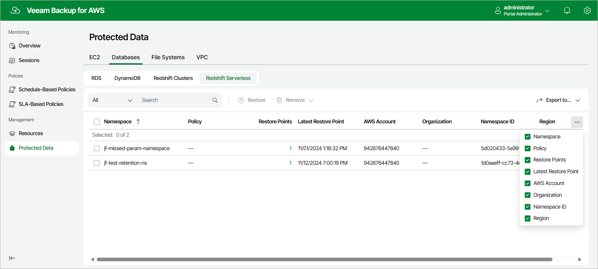

In this article

After a backup policy successfully creates a restore point of a Redshift Serverless namespace according to the specified schedule, or after you create a backup of a Redshift Serverless namespace manually, Veeam Backup for AWS adds the namespace to the resource list on the Protected Data page.

For each backed-up Redshift Serverless namespace, Veeam Backup for AWS creates a record in the configuration database with the following set of properties:

* Namespace — the name of the Redshift Serverless namespace.
* Policy — the name of the backup policy that processed the Redshift Serverless namespace.
* Restore Points — the number of restore points created for the Redshift Serverless namespace.

To view the list of restore points, click the link in the Restore Points column. The Available Restore Points window will display information on each restore point, including the following: the date when the restore point was created, the type of the restore point, the restore point region and the configured retention policy settings (D — daily, W — weekly, M — monthly or Y — yearly).

* Latest Restore Point — the date and time of the latest restore point that was created for the Redshift Serverless namespace.

* AWS Account — the AWS account to which the Redshift Serverless namespace belong.

* Organization — the AWS Organization to which the Redshift Serverless namespace belongs.

* Namespace ID — the AWS ID of the Redshift Serverless namespace.
* Region — the AWS Region in which the Redshift Serverless namespace resides.

On the Protected Data page, you can also perform the following actions:

* Remove restore points if you no longer need them. For more information, see sections [Removing Redshift Serverless Backups](backups_remove_redshift_serverless.md) and [Removing Redshift Serverless Backups Created Manually](backups_remove_individual_redshift_serverless.md).
* Restore data of backed-up Redshift Serverless namespaces. For more information, see [Redshift Serverless Restore Using Web UI](redshift_serverless_restore_ui.md).

Page updated 9/29/2025

Page content applies to build 10.0.0.232
