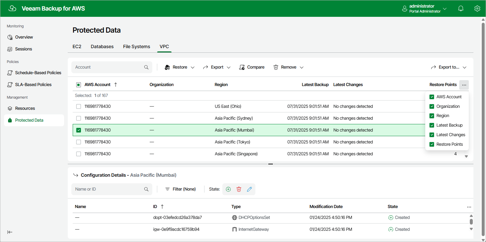

In this article

After the VPC Configuration Backup policy successfully creates a restore point for the VPC configuration of an AWS Region within an AWS account, the configuration record is automatically added to the resource list on the Protected Data page.

For each protected AWS Region within the AWS account, Veeam Backup for AWS creates a configuration record in the database with the following set of properties:

* AWS Account — the AWS account whose IAM role was used to collect VPC configuration data.

* Organization — the name of the AWS Organization whose AWS account was used to collect VPC configuration data.

* Region — the AWS Region whose VPC configuration data is backed up.
* Latest Backup — the date and time of the latest created restore point.
* Latest Changes — the summary of changes in the VPC configuration in comparison with the previous restore point.
* Restore Points — the total number of restore points created for the VPC configuration.

On the Protected Data page, you can perform the following actions:

* Compare the attributes of the current VPC configuration with the attributes stored in a backup. For more information, see [Comparing VPC Configuration Backups](backups_compare_vpc.md).
* Export the backed-up VPC configuration data to an AWS CloudFormation template. For more information, see [Exporting VPC Configuration](export_vpc.md).
* Remove restore points if you no longer need them. For more information, see [Removing VPC Configuration Backups](backups_remove_vpc.md).

* Restore data of backed-up VPC configurations. For more information, see [VPC Configuration Restore Using Web UI](vpc_restore_ui.md).

Page updated 9/29/2025

Page content applies to build 10.0.0.232
