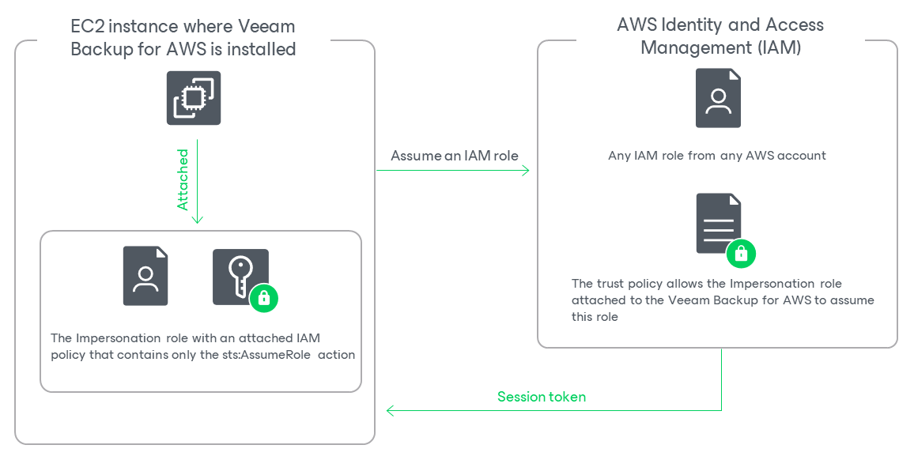

In this article

When you deploy a backup appliance, Veeam Backup for AWS automatically creates a specific IAM role named Impersonation role — and attaches this role to the backup appliance. The Impersonation IAM role is then used to assume other IAM roles added to Veeam Backup for AWS to perform operations in your infrastructure, and is automatically assigned the sts:AssumeRole permission required to assume these roles.

Before you start adding an IAM role to Veeam Backup for AWS, you must check the following prerequisites:

* The Impersonation IAM role must have the following permissions:

|  |
| --- |
| {     "Version": "2012-10-17",     "Statement": [         {             "Effect": "Allow",             "Action": [                 "sts:AssumeRole"             ],             "Resource": "\*"         }     ]  } |

To obtain the ARN of the Impersonation IAM role, you can look it up on the Instances page in the EC2 сonsole.

* Trust relationships must be configured for the IAM role you want to add, and the following statement must be included into the trust policy:

|  |
| --- |
| {     "Version": "2012-10-17",     "Statement": [         {             "Effect": "Allow",             "Action": "sts:AssumeRole",             "Principal": {                 "AWS": "<Role ARN>"             }         }     ]  } |

Where <Role ARN> is either the ARN of the Impersonation IAM role or the ARN of the AWS account to which the backup appliance belongs.

Configuring Trust Relationships

To allow Veeam Backup for AWS to use an IAM role to perform operations in your infrastructure, you must configure trust relationships for the role you want to add:

1. Open the [EC2 console](https://console.aws.amazon.com/ec2/v2/home) and do the following:

1. Navigate to Instances.
2. In the Instances section, locate the EC2 instance running the backup appliance.
3. On the Summary page, switch to the Security tab and click the link next to the IAM Role field. The IAM console will open.

1. In the [IAM console](https://console.aws.amazon.com/iamv2/home), do the following:

1. Copy the value displayed in the ARN field — you will need it later.
2. Navigate to Roles and locate the IAM role for which you want to configure trust relationships.
3. On the Summary page, switch to the Trust relationships tab and click Edit trust policy.
4. In the Edit trust policy field, add the following statement:

|  |
| --- |
| {     "Version": "2012-10-17",     "Statement": [         {             "Effect": "Allow",             "Action": "sts:AssumeRole",             "Principal": {                 "AWS": "<Role ARN>"             }         }     ]  } |

Where <Role ARN> is the ARN either of the Impersonation IAM role that you have copied at step 2a, or the ARN of the AWS account to which the backup appliance belongs.

1. Click Update policy. Note that it may take up to 5 minutes for AWS to update the trust policy.

Page updated 4/30/2025

Page content applies to build 10.0.0.232
