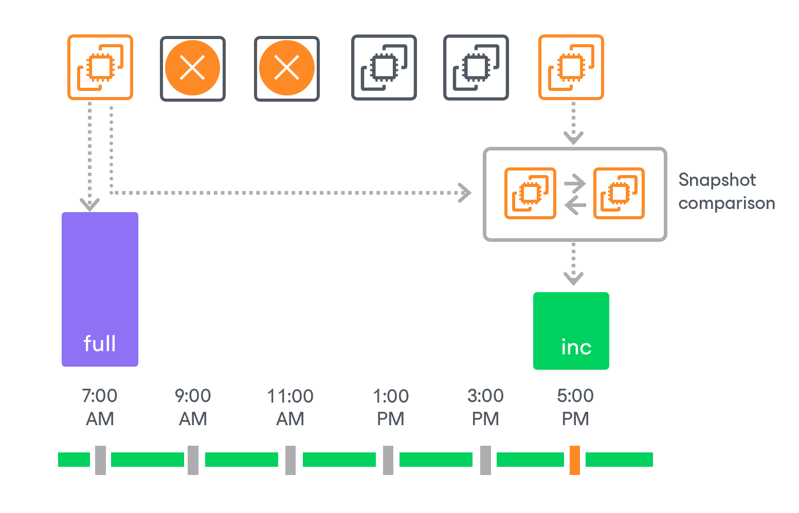
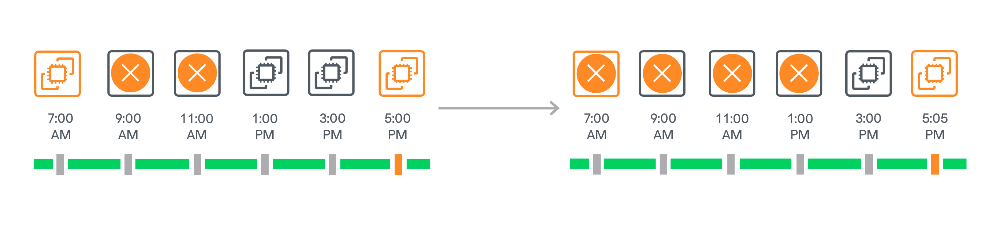

In this article

If CBT can be used, Veeam Backup for AWS does not remove the cloud-native snapshot used as a source for the image-level backup from the snapshot chain until the next image-level backup session completes. Therefore, at some point you may discover that Veeam Backup for AWS ignores retention policy settings and keeps an additional restore point in the snapshot chain.

Example 1. Creating Schedule-Based Backup Policy

Consider the following example. You configured a schedule-based backup policy to create cloud-native snapshots of your critical workloads 6 times a day (at 7:00 AM, 9:00 AM, 11:00 AM, 1:00 PM, 3:00 PM, and 5:00 PM) and to keep 2 daily snapshots in the snapshot chain. You also enabled creation of image-level backups 2 times a day (at 7:00 AM and 5:00 PM) and configured the retention policy settings to keep the backups in a backup repository for 7 days.

Veeam Backup for AWS will run the backup policy in the following way:

1. At 7:00 AM, the first backup session will create a cloud-native snapshot, and then will use this snapshot to create a full image-level backup.
2. From 9:00 AM to 3:00 PM, subsequent sessions will create only cloud-native snapshots.

1. After the backup session runs at 11:00 AM, the length of the snapshot chain (3 restore points) will exceed the retention limit (2 restore points). The earliest snapshot, however, will not be removed as it will be used to track changed data at 5:00 PM when the next image-level backup creation is scheduled.
2. After the backup session runs at 1:00 PM and 3:00 PM, Veeam Backup for AWS will remove the snapshots created at 9:00 AM and 11:00 AM. The length of the snapshot chain will remain 3 restore points.

1. At 5:00 PM, the backup session will create a new cloud-native snapshot. Veeam Backup for AWS will compare this snapshot with the one created at 7:00 AM to identify changed data blocks. After that, the backup session will create an incremental image-level backup based on the data obtained during the snapshot comparison.

1. After the snapshot comparison, Veeam Backup for AWS will apply the retention policy and remove from the chain the snapshot created at 7:00 AM (as it is no longer needed) and the snapshot created at 1:00 PM.

Example 2. Creating SLA-Based Backup Policy

Consider the following example. You configured an SLA-based backup policy to create cloud-native snapshots of your critical workloads every day at 7:00 AM. You also enabled creation of image-level backups 2 times a week (on Monday and Friday at 7:00 AM) and configured the retention policy settings to keep the snapshots for 2 days.

Veeam Backup for AWS will run the backup policy in the following way:

1. On the first day (Monday), the backup session will start at 7:00 AM to create a cloud-native snapshot, and then will use this snapshot to create a full image-level backup.
2. On the next days (Tuesday and Wednesday), subsequent backup sessions will start at 7:00 AM to create only cloud-native snapshots. The number of days will exceed the retention limit (2 days). The snapshot created on Monday, however, will not be removed as it will be used to track changed data on Friday when the next image-level backup creation is scheduled.
3. On the next day (Thursday), the backup session will start at 7:00 AM to create only a cloud-native snapshot. The number of days will exceed the retention limit once again. Veeam Backup for AWS will apply the retention policy and remove the snapshot created on Tuesday from the chain.
4. On the next day (Friday), the backup session will start at 7:00 AM to create a cloud-native snapshot. Veeam Backup for AWS will compare this snapshot with the one created at 7:00 AM on Monday to identify changed data blocks. After that, the backup session will create an incremental image-level backup based on the data obtained during the snapshot comparison. Veeam Backup for AWS will apply the retention policy and remove the snapshot created on Wednesday from the chain.
5. On the next day (Saturday), the backup session will create a cloud-native snapshot. Veeam Backup for AWS will apply the retention policy and remove from the chain the snapshot created on Monday (as it is no longer needed) and the snapshot created on Thursday.

Related Topics

[Changed Block Tracking](cbt.md)

Page updated 1/8/2026

Page content applies to build 10.0.0.232
