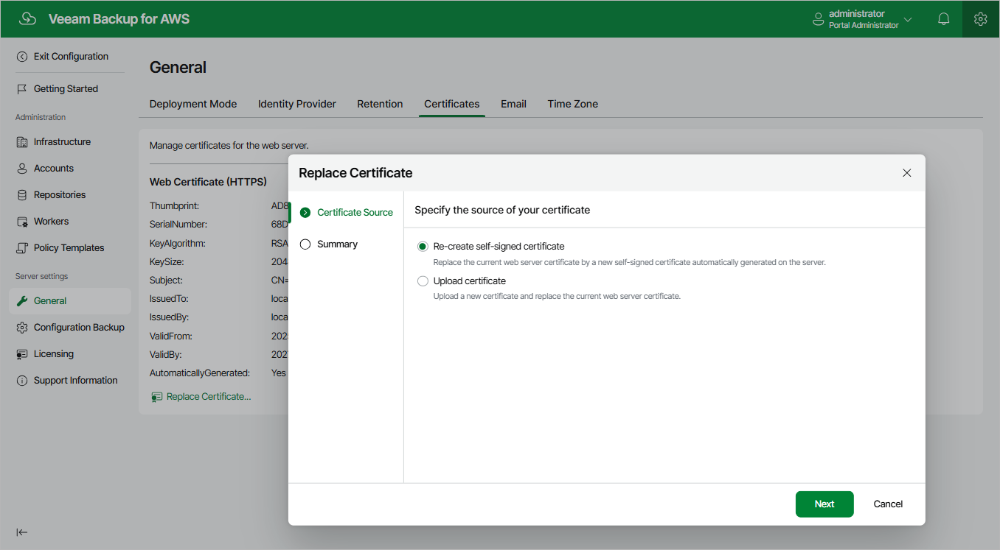

In this article

To establish secure data communications between the backup appliance and web browsers running on user workstations, Veeam Backup for AWS uses Transport Layer Security (TLS) certificates.

|  |
| --- |
| Important |
| Starting from Veeam Backup for AWS version 5.0, only the TLS v1.3 certificates are supported. Therefore, Veeam Backup for AWS will automatically recreate the previously generated self-signed certificate when updating the backup appliance. |

When you install Veeam Backup for AWS, it automatically generates a default self-signed certificate. You can replace this default certificate with your own self-signed certificate or with a certificate obtained from a Certificate Authority (CA). To replace the currently used TLS certificate, do the following:

1. Switch to the Configuration page.

1. Navigate to General > Certificates.

1. Click Replace Web Certificate.

Complete the New Certificate Wizard.

1. At the Certificate Source step of the wizard, do the following:

* Select the Recreate a self-sign certificate option if you want to replace the existing certificate with a new self-signed certificate automatically generated by Veeam Backup for AWS.
* Select the Upload certificate option if you want to upload a certificate that you obtained from a CA or generated using a 3rd party tool.

1. [Applies only if you have selected the Upload certificate(s) option] At the Upload certificate(s) step of the wizard, browse to the certificate that you want to install, and provide a password for the certificate file if required.

|  |
| --- |
| Note |
| Veeam Backup for AWS supports certificates only in the .PFX and .P12 formats. |

1. At the Summary step of the wizard, review summary information and click Finish.

|  |
| --- |
| Important |
| * If you have recreated the self-signed certificate, the browser from which you will try to access Veeam Backup for AWS next time will display a warning notifying that the connection is untrusted (although it is secured with SSL). To eliminate the warning, import the self-signed certificate to user workstations.  * If you have recreated the certificate for a backup appliance managed by the Veeam Backup & Replication server, Veeam Backup & Replication will not be able to license resources and to collect resource data. To work around the issue, accept the newly created certificate using the Veeam Backup & Replication console as described in section [Editing Appliance Settings](edit_appliance.md). |

Page updated 7/4/2025

Page content applies to build 10.0.0.232
