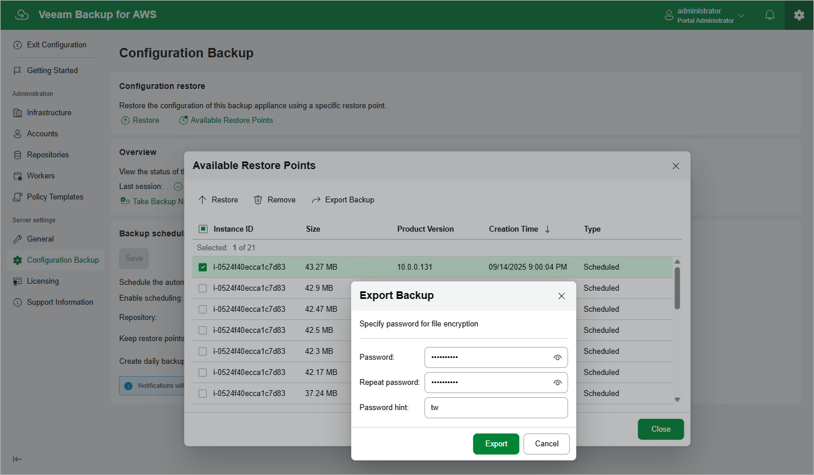

In this article

Once Veeam Backup for AWS creates a successful configuration backup, you can export the configuration backup file and use it to [restore configuration data](config_restore_web_ui.md) on another backup appliance.

To export the configuration backup file to a local machine, do the following:

1. Switch to the Configuration page.
2. Navigate to Configuration Backup.
3. Use one of the following options:

* To export the last successful configuration backup:

1. In the Overview section, click Export Last Backup.
2. In the Export Last Backup window, specify a password that will be used to encrypt the exported file, provide a hint for the specified password, and click Export.

* To export a specific configuration backup file:

1. In the Configuration restore section, click Available Restore Points.
2. In the Available Restore Points window, select the necessary backup and click Export Backup.

1. In the Export Backup window, specify a password that will be used to encrypt the exported file, provide a hint for the specified password, and click Export.

As soon as you click Export, Veeam Backup for AWS will save the exported backup file to the default download directory on the local machine.

Page updated 9/15/2025

Page content applies to build 10.0.0.232
