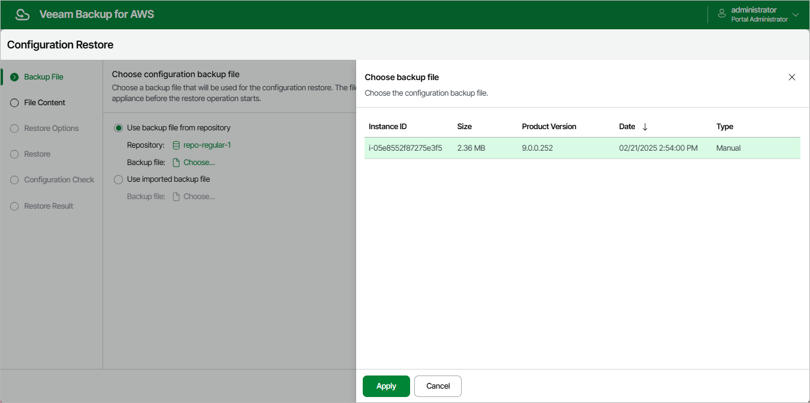

In this article

At the Backup File step of the wizard, choose whether you want to use an exported backup file or a backup file stored in a backup repository.

* If you want to use a file stored in a backup repository, select the Use backup file from repository option and do the following:

1. Click the link next to the Repository field, and use the list of available repositories in the Choose repository window to select the repository where the configuration backup file is stored.

For a backup repository to be displayed in the list of available repositories, it must be added to Veeam Backup for AWS as described in section [Adding Backup Repositories Using Web UI](repositories_add_ui.md). The repository list shows only backup repositories that store configuration backup files.

1. Click the link next to the Backup file field, select the necessary file in the Choose backup file window and click Apply.

* If you want to use a file that was exported from this or another backup appliance, select the Use imported backup file option, and do the following:

1. Click the link next to the Backup file field.
2. In the Import backup file window, browse to the necessary backup file, provide the password that was used to encrypt the file, and click Import.

Page updated 8/20/2025

Page content applies to build 10.0.0.232
