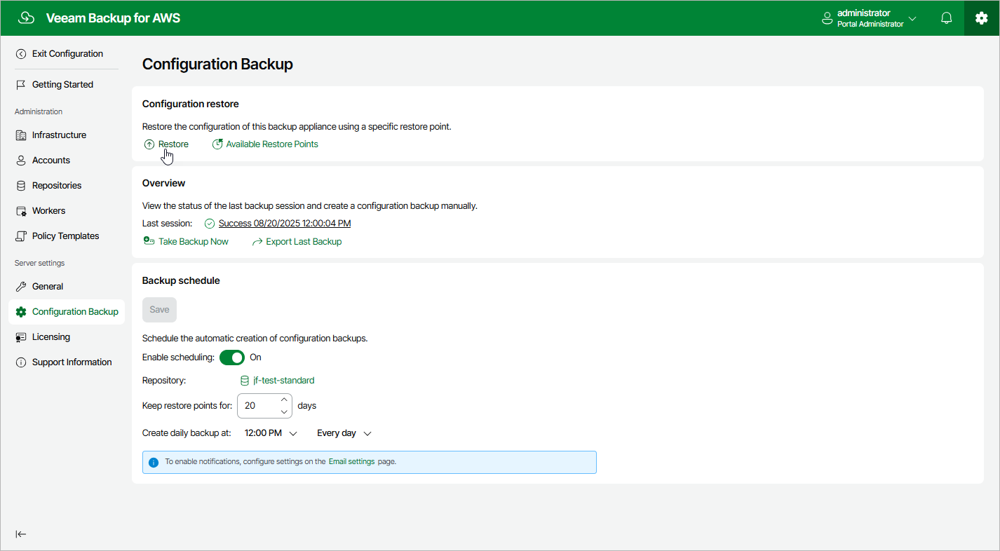

In this article

To launch the Configuration Restore wizard, do the following:

1. Switch to the Configuration page.
2. Navigate to Configuration Backup.
3. In the Configuration restore section, click Restore.

Page updated 8/20/2025

Page content applies to build 10.0.0.232
