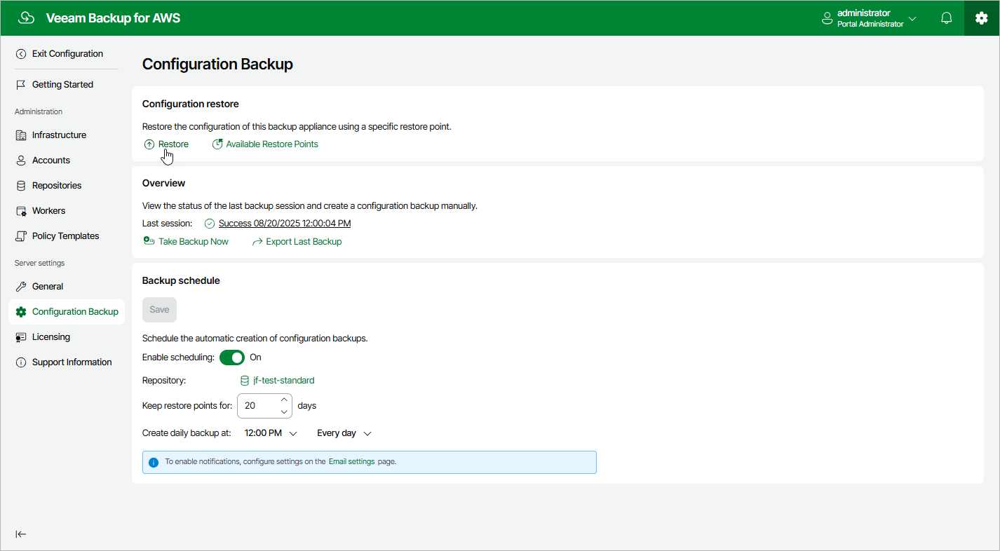

# Step 1. Launch Configuration Restore Wizard

To launch the Configuration Restore wizard, do the following:

1. Switch to the Configuration page.
2. Navigate to Configuration Backup.
3. In the Configuration restore section, click Restore.

