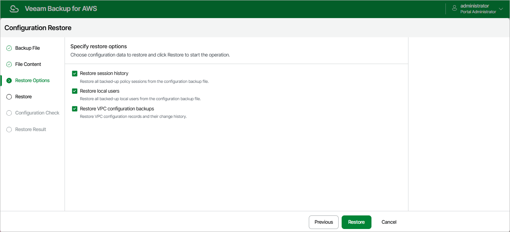

In this article

By default, Veeam Backup for AWS restores only configuration data for the existing infrastructure components, created backup policies and configured global settings. At the Restore Options step of the wizard, you can choose whether you want to restore session logs, user accounts of the initial backup appliance and VPC configuration backups as well.

|  |
| --- |
| Important |
| After you click Restore, the restore process will start. You will not be able to halt the process or edit the restore settings. |

Page updated 8/20/2025

Page content applies to build 10.0.0.232
