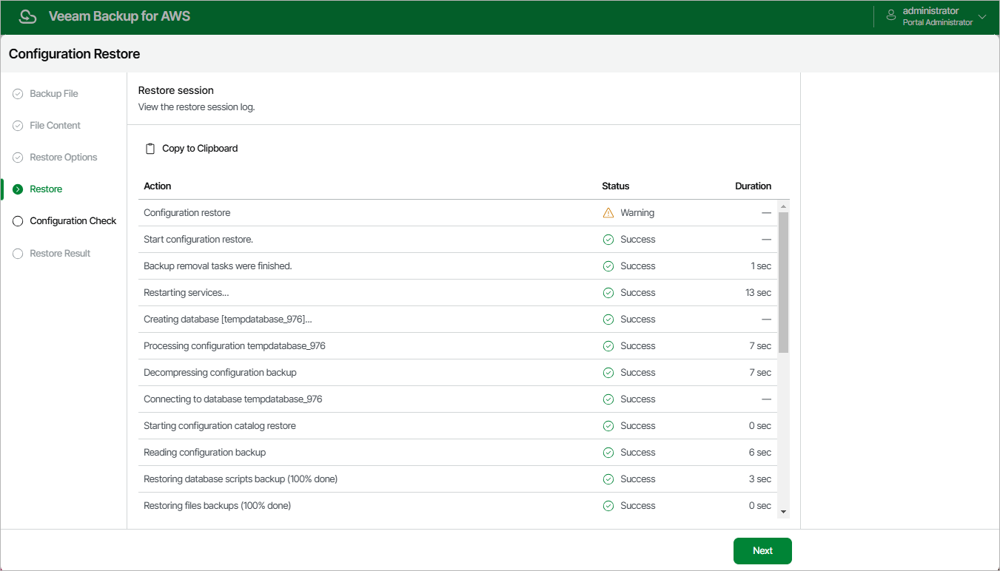

# Step 5. Track Restore Progress

Veeam Backup for AWS will display the results of every step performed while executing the configuration restore. At the Restore step of the wizard, wait for the restore process to complete and click Next.

