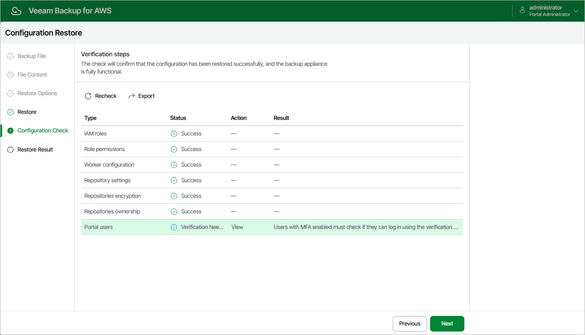

In this article

After the restore process is over, Veeam Backup for AWS will run a number of verification checks to confirm that the configuration data has been restored successfully. At the Configuration Check step of the wizard, wait for the verification checks to complete and check whether Veeam Backup for AWS encountered any configuration issues.

If Veeam Backup for AWS encounters an issue while performing a verification check, the Result column will display a description of the issue, and the Action column will provide instructions on how to resolve it. For example, to resolve the issue with IAM role permissions, do the following:

1. In the Action column, click View in the Role permissions field.
2. In the IAM role permissions window, review IAM roles that are missing permissions required to perform operations, and choose one of the following options:

* If you do not plan to use an IAM role to perform Veeam Backup for AWS operations, skip the notification and, after the configuration restore operation completes, specify a new role in the repository, policy and worker settings shown in the Used As column.
* If you want to grant the missing permissions to an IAM role in the AWS Management Console, select the necessary role and click Export Missing Permissions to download the full list of missing permissions as a single JSON policy document.
* If you want to instruct Veeam Backup for AWS to assign the missing permissions to an IAM role, select the necessary role and click Grant.

In the Grant permissions window, provide one-time access keys of an IAM user that is authorized to update permissions of IAM roles, and then click Grant.

The IAM user must have the following permissions:

|  |
| --- |
| {     "Version": "2012-10-17",     "Statement": [         {             "Effect": "Allow",             "Action": [                "iam:AttachRolePolicy",                "iam:CreatePolicy",                "iam:CreatePolicyVersion",                "iam:GetAccountSummary",                "iam:GetPolicy",                "iam:GetPolicyVersion",                "iam:GetRole",                "iam:ListAttachedRolePolicies",                "iam:ListPolicyVersions",                "iam:SimulatePrincipalPolicy",                "iam:UpdateAssumeRolePolicy"             ],             "Resource": "\*"         }     ]  } |

|  |
| --- |
| Note |
| Veeam Backup for AWS does not store one-time access keys in the configuration database. |

After you resolve all issues, click Recheck to ensure the backup appliance is now fully functional, and click Next.

|  |
| --- |
| Important |
| Restored repositories must not be managed by multiple backup appliances simultaneously — retention sessions running on different backup appliances may corrupt backup files stored in the repositories, which may result in unpredictable data loss. That is why Veeam Backup for AWS verifies whether the restored backup repositories are managed by any backup appliances — but only for those repositories that were added to Veeam Backup for AWS version 7.0 or later. If the backup repositories are already managed by any backup appliances, Veeam Backup for AWS encounters an issue while performing a verification check. To resolve the issue, you must change the owner of these repositories to complete the restore session. To do that, in the Action column, click View in the Repositories ownership field. Then, click Take Ownership in the Repository ownership window. |

Page updated 8/20/2025

Page content applies to build 10.0.0.232
