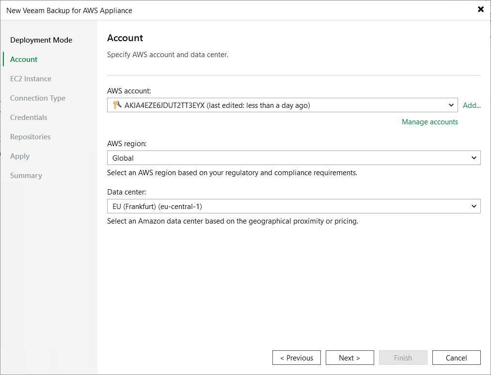

In this article

At the Account step of the wizard, do the following:

1. From the AWS account drop-down list, select access keys of an IAM user that belongs to an AWS account in which the backup appliance has been deployed. Veeam Backup & Replication will use permissions of the specified IAM user to connect to the backup appliance. For more information on the required permissions, see [Plug-in Permissions](req_permissions.md).

For access keys of an IAM user to be displayed in the AWS account drop-down list, they must be created in AWS and added to the Cloud Credentials Manager as described in the Veeam Backup & Replication User Guide, section [Access Keys for AWS Users](https://helpcenter.veeam.com/docs/vbr/userguide/cloud_credentials_aws.html?ver=13). If you have not added the necessary keys to the Cloud Credentials Manager beforehand, you can do it without closing the wizard. To do that, click either the Manage accounts link or the Add button, and specify the access key and secret key in the Credentials window.

1. From the AWS region drop-down list, specify whether the backup appliance resides in the AWS Global or AWS GovCloud (US) region.
2. From the Data center drop-down list, select the AWS Region in which the backup appliance resides.

For more information on regions and availability zones, see [AWS Documentation](https://aws.amazon.com/about-aws/global-infrastructure/regions_az/?nc1=h_ls).

|  |
| --- |
| Important |
| To check the availability of the region, Veeam Backup & Replication by default establishes a temporary test connection with the US East (N. Virginia) region using endpoints of the [AWS Security Token Service (STS)](https://docs.aws.amazon.com/general/latest/gr/sts.html) and [Amazon Elastic Compute Cloud (EC2)](https://docs.aws.amazon.com/general/latest/gr/ec2-service.html) AWS services. That is why the backup server must have access to this AWS Region. If you want to change the default region for a test connection, open a [support case](logs.md). |

Page updated 8/11/2025

Page content applies to build 10.0.0.232
