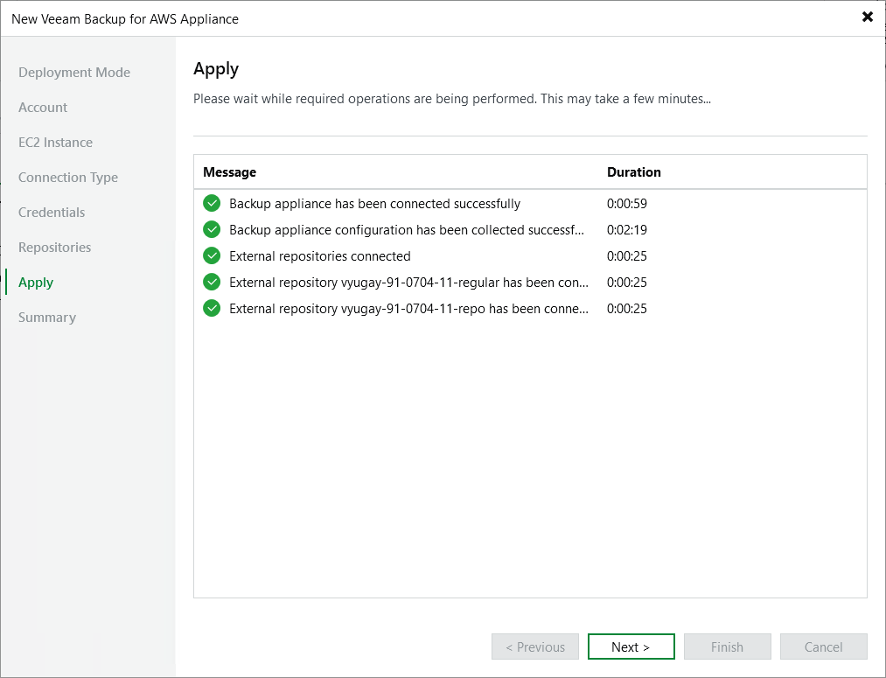

In this article

Veeam Backup & Replication will display the results of every step performed while connecting the backup appliance. At the Apply step of the wizard, wait for the process to complete and click Next.

|  |
| --- |
| Note |
| When adding an existing appliance to the backup infrastructure, Veeam Backup & Replication collects session results only for the past 48 hours, as well as information on all snapshots, backups and policies. |

Page updated 9/2/2025

Page content applies to build 10.0.0.232
