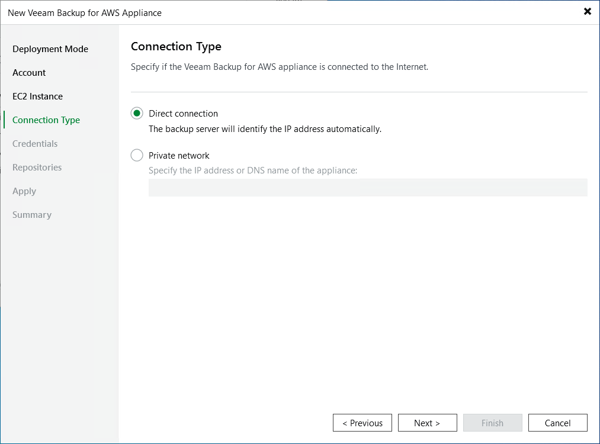

In this article

At the Connection Type step of the wizard, specify the way Veeam Backup & Replication will connect to the backup appliance:

* Select the Direct connection option if the backup appliance is connected to a VPC network with the inbound internet access allowed and you want the backup server to connect to this Veeam Backup for AWS appliance over the internet. In this case, Veeam Backup & Replication will detect the public IP of the Veeam Backup for AWS appliance automatically.
* Select the Private network option if the backup appliance and the backup server are deployed within the same VPC network, or if the backup appliance is deployed without a public IP address. In this case, you must specify the private IP address or DNS hostname of the backup appliance in the Specify the IP address or DNS name of the appliance field.

Note that you will have to establish connection between the VPC network of the appliance deployed in a private environment and your on-premises network to allow a Veeam Backup & Replication server to communicate with the backup appliance. For more information, see [Backup Appliances in Private Environment](appliance_in_private.md).

Page updated 9/2/2025

Page content applies to build 10.0.0.232
