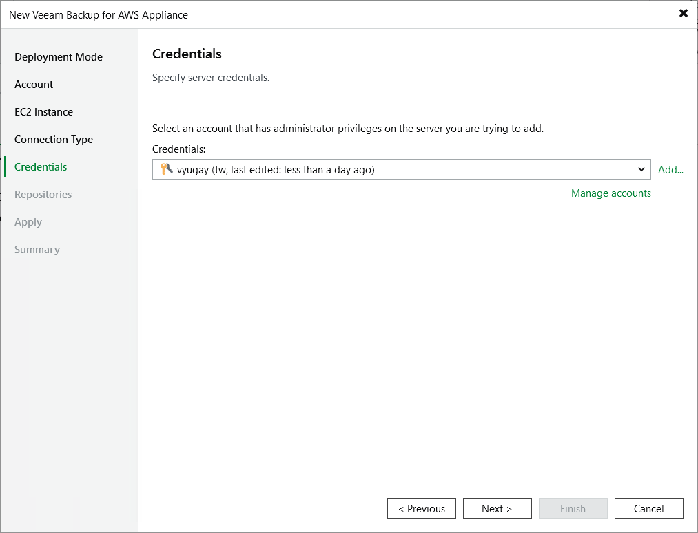

In this article

At the Credentials step of the wizard, specify a user whose credentials Veeam Backup & Replication will use to connect to the backup appliance.

For a user to be displayed in the Credentials list, it must be added to the Credentials Manager as described in the Veeam Backup & Replication User Guide, section [Standard Accounts](https://helpcenter.veeam.com/docs/vbr/userguide/credentials_manager_windows.html?ver=13). If you have not added the necessary user to the Credentials Manager beforehand, you can do it without closing the New Veeam Backup for AWS Appliance wizard. To do that, click either the Manage accounts link or the Add button, and specify the user name, password and description in the Credentials window.

|  |
| --- |
| Important |
| * The security group associated with the backup appliance must allow inbound HTTPS traffic (port 443) from the backup server IP address. Otherwise, you will not be able to proceed with the wizard.  * The specified user must have multi-factor authentication (MFA) disabled and the Portal Administrator role assigned. |

|  |
| --- |
| Note |
| As soon as you click Next, Veeam Backup & Replication will verify connection to the specified backup appliance. If the version of the appliance is not compatible with the Veeam Backup & Replication version or if the TLS certificate used to connect to the Veeam Backup for AWS Web UI is not trusted, you will receive a warning. To learn how to eliminate this warning, see [Eliminating Warnings](connect_appliance_warnings.md). |

Page updated 9/2/2025

Page content applies to build 10.0.0.232
