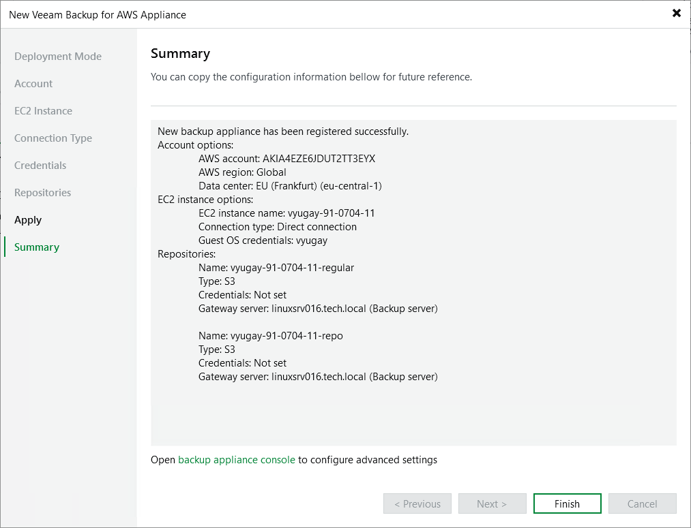

In this article

At the Summary step of the wizard, review summary information and click Finish.

After the backup appliance is added to the backup infrastructure, you can configure its settings in the Veeam Backup for AWS Web UI as described in section [Configuring Veeam Backup for AWS](configuration.md). If you want Veeam Backup & Replication to open the Web UI of the added backup appliance immediately, click the backup appliance console link.

Page updated 9/2/2025

Page content applies to build 10.0.0.232
