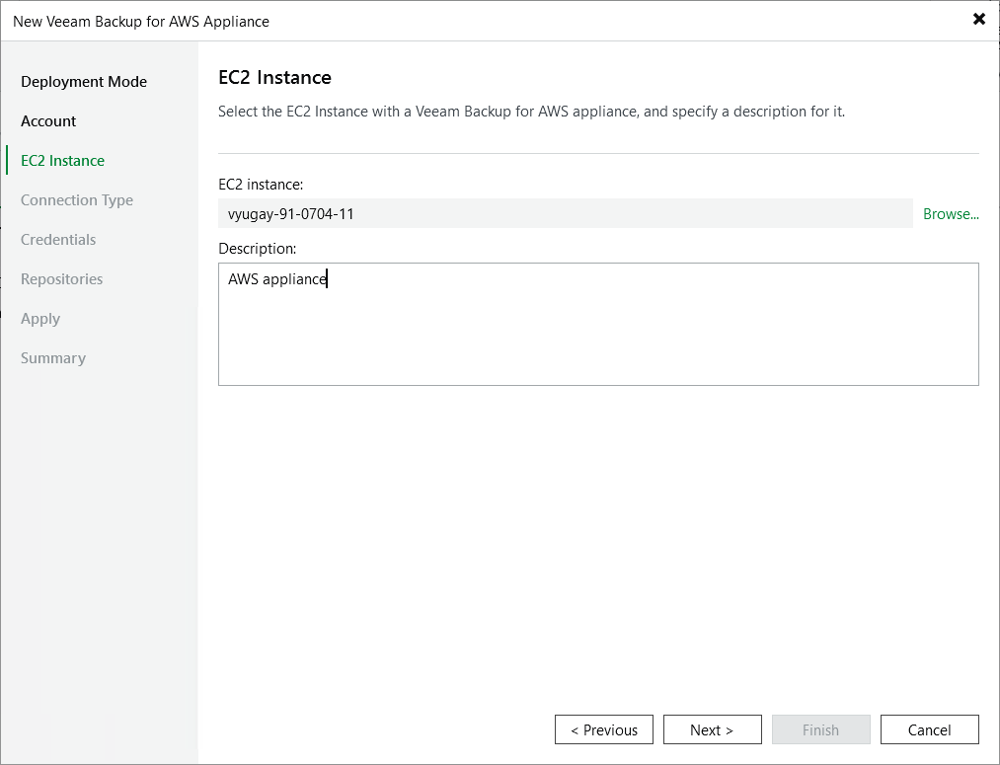

In this article

At the EC2 Instance step of the wizard, choose the EC2 instance running the backup appliance and provide a description for future reference. For the EC2 instance to be displayed in the list of available instances, it must belong to the same AWS account as the IAM user specified at [step 3](connect_appliance_account.md) of the wizard.

Page updated 10/3/2025

Page content applies to build 10.0.0.232
