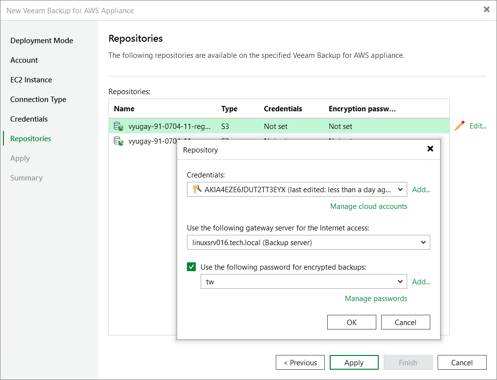

In this article

At the Repositories step of the wizard, a list of all standard and archive backup repositories already configured on the selected backup appliance will be displayed. After you complete the wizard, Veeam Backup & Replication will automatically add these repositories to the backup infrastructure.

You can specify the following configuration settings for each repository whose restore points you want to use to recover backed-up data:

|  |
| --- |
| Note |
| The following procedure applies only to standard backup repositories. For archive backup repositories, there is no possibility to specify any configuration settings. |

1. In the Repositories list, select the necessary repository and click Edit.
2. In the Repository window:

1. From the Credentials drop-down list, select access keys of an IAM user whose permissions will be used to access the repository. For more information on the required permissions, see [Plug-in Permissions](req_permissions.md#add_repository).

For access keys of an IAM user to be displayed in the Credentials list, they must be added to the Cloud Credentials Manager as described in the Veeam Backup & Replication User Guide, section [Access Keys for AWS Users](https://helpcenter.veeam.com/docs/vbr/userguide/cloud_credentials_aws.html?ver=13). If you have not added the necessary keys to the Cloud Credentials Manager beforehand, you can do it without closing the Repository window. To do that, click either the Manage accounts link or the Add button, and specify the access and secret key in the Credentials window.

|  |
| --- |
| Note |
| If you do not specify access keys of an IAM user for a standard backup repository, you will only be able to use the Veeam Backup & Replication console to perform [entire EC2 instance restore](restoring_to_amazon.md), [RDS instance restore](restore_rds.md) and [EFS file systems restore](restore_entire_efs_console.md) from backups stored in this repository. Moreover, information on the repository displayed in the Backup Infrastructure view under the External Repositories node will not include statistics on the amount of storage space that is currently consumed by restore points created by Veeam Backup for AWS. |

1. From the Use the following gateway server for the Internet access drop-down list, select a gateway server that will be used to provide access to the repository.

For a gateway server to be displayed in the Use the following gateway server for the Internet access drop-down list, it must be added to the backup infrastructure. For more information on gateway servers, see [Solution Architecture](overview.md).

1. If encryption is enabled for the repository, the following scenarios may apply:

* If data in the repository is encrypted using a password, select the Use the following password for encrypted backups check box. From the drop-down list, select the password that is used to encrypt data. Veeam Backup & Replication will use the specified password to decrypt backup files stored in this repository.

For a password to be displayed in the Use the following password for encrypted backups drop-down list, it must be added to the Password Manager as described in the Veeam Backup & Replication User Guide, section [Creating Passwords](https://helpcenter.veeam.com/docs/vbr/userguide/password_manager_create.html?ver=13). If you have not added the necessary password beforehand, you can do it without closing the Repository window. To do that, click either the Manage accounts link or the Add button, and specify the password and hint in the Password window.

|  |
| --- |
| Note |
| If you do not specify a password for a standard backup repository with encryption enabled, you will have to decrypt data stored in this repository manually as described in section [Managing Backed-Up Data Using Console](managing_data_console.md#decrypt_backups). |

* If data in the repository is encrypted with a KMS key, Veeam Backup & Replication will show the used KMS key in the Perform AWS encryption with the following KMS key drop-down list but will not allow the user to change it.

For Veeam Backup & Replication to be able to decrypt data stored in the repository, the IAM user whose permissions will be used to access the repository must also have permissions to access KMS keys. For more information on the required permissions, see [Plug-in Permissions](req_permissions.md#kms_permissions).

After you finish working with the wizard, all the added repositories will be displayed in the Backup Infrastructure view under the External Repositories node.

|  |
| --- |
| Note |
| If some of the repositories are already added to the backup infrastructure of another backup server, you will be prompted to claim the ownership of these repositories. To learn how to claim the ownership, see the Veeam Backup & Replication User Guide, section [Ownership](https://helpcenter.veeam.com/docs/vbr/userguide/external_repository_ownership.html?ver=13). |

Related Topics

[Managing Backed-Up Data Using Console](managing_data_console.md)

Page updated 10/13/2025

Page content applies to build 10.0.0.232
