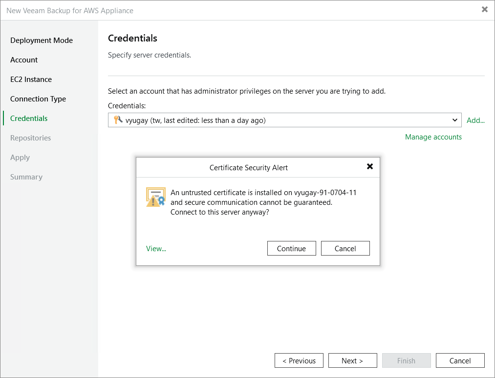

In this article

If Veeam Backup & Replication encounters an issue while verifying the connection to the specified backup appliance, you may get one of the following warnings.

Version Compatibility Alert

If you try to add to the backup infrastructure an appliance that runs a version of Veeam Backup for AWS that is not [compatible with the version](system_requirements.md#versions) of Veeam Backup & Replication, Veeam Backup & Replication will display a warning notifying that the appliance must be upgraded. To eliminate the warning, click Yes. Veeam Backup & Replication will automatically upgrade the appliance to the necessary version.

|  |
| --- |
| Important |
| * If the backup appliance has a marketplace license, it will no longer have the [product code](https://docs.aws.amazon.com/marketplace/latest/userguide/ami-getting-started.html#ami-product-codes) assigned after the upgrade. * If you remove the upgraded backup appliance that previously used a marketplace license, then you will no longer be able to switch to the Paid marketplace license, and the appliance will operate using the Free marketplace license. For more information on license editions, see [Licensing](licensing.md). |

During the [upgrade from version 6.0 or earlier](upgrade_vb_console.md), Veeam Backup & Replication will verify whether the IAM user whose access keys are used to connect to the appliance has sufficient permissions to upgrade the appliance. If some permissions are missing, you will receive a warning.

You can manually grant missing permissions to the IAM user using AWS or instruct Veeam Backup & Replication to do it:

* If you want to grant the missing permissions manually, do the following:

1. Click Copy permissions to Clipboard.

Note that the list of copied permissions will contain all the permissions required to perform the upgrade operation, not the list of missing permissions.

1. In AWS, create an IAM policy with the missing permissions and attach the policy to the IAM user whose access key are used to connect to the appliance.

To learn how to create IAM policies, see [Appendix B. Creating IAM Policies in AWS](create_iam_policy.md).

1. Back to the Veeam Backup & Replication console, click Proceed.

* If you want to instruct Veeam Backup & Replication to grant the missing permissions automatically, click Grant and provide one-time access keys of an IAM user that is [authorized to grant IAM permissions](req_permissions.md#iam_user_grant_permissions) in the opened window. Note that the specified user must belong to the same AWS account in which the Veeam Backup for AWS appliance is deployed.

Veeam Backup & Replication will create an IAM policy with missing permissions and attach the policy to the IAM user whose permissions are used to connect to the appliance.

|  |
| --- |
| Note |
| Veeam Backup & Replication does not store the provided one-time access keys in the configuration database. |

Certificate Security Alert

When you add a backup appliance to the backup infrastructure, Veeam Backup & Replication saves in the configuration database a thumbprint of the TLS certificate installed on the appliance. When Veeam Backup & Replication connects to the appliance, it uses the saved thumbprint to verify the appliance identity and to avoid the man-in-the-middle attack. For more information on managing TLS certificates, see [Replacing Security Certificates](certificates_settings.md).

If the certificate installed on the backup appliance is not trusted, Veeam Backup & Replication will display a warning notifying that secure connection cannot be guaranteed. You can view the certificate and click Continue — in this case, Veeam Backup & Replication will remember the certificate thumbprint and will further trust the certificate when connecting to the appliance. Otherwise, you will not be able to proceed with the wizard.

|  |
| --- |
| Note |
| When you update a TLS certificate installed on a backup appliance, this appliance becomes unavailable in the Veeam Backup & Replication console. To make the appliance available again, acknowledge the new certificate at the Credentials step of the [Edit Veeam Backup for AWS Appliance wizard](edit_appliance.md). |

Page updated 9/2/2025

Page content applies to build 10.0.0.232
