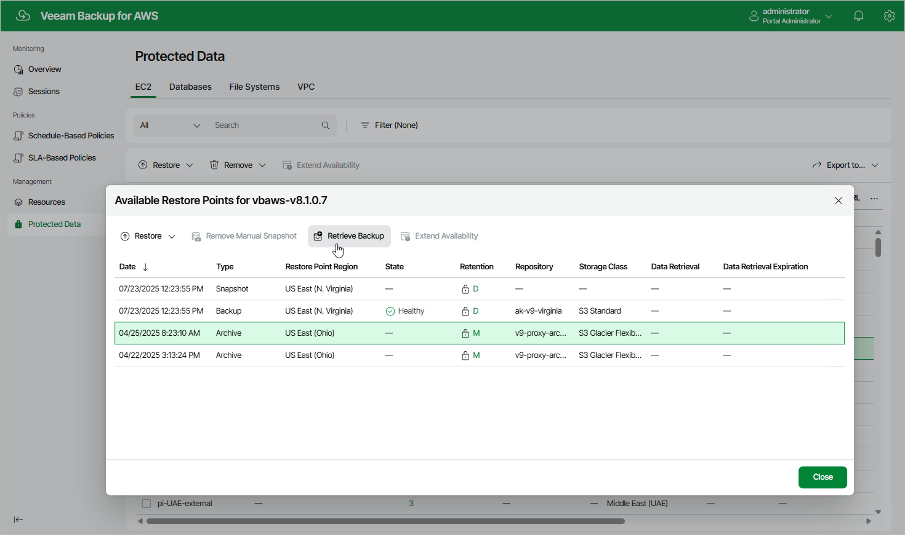
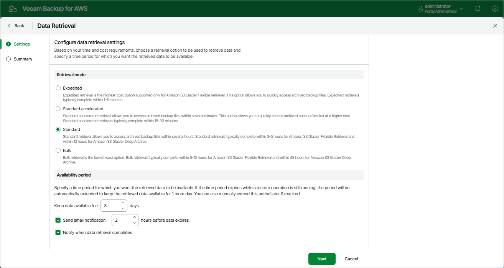
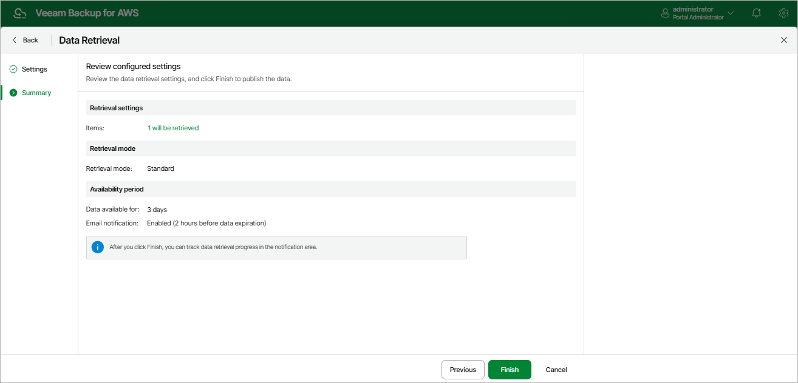
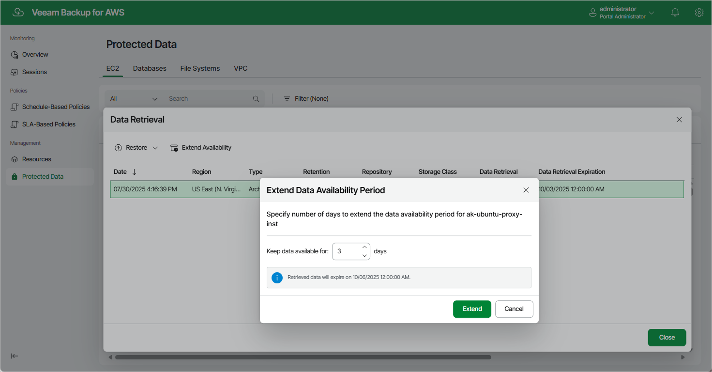

In this article

Backups stored in archive backup repositories are not immediately accessible. If you want to restore an EC2 instance from a backup that is stored in a repository of the S3 Glacier Flexible Retrieval or S3 Glacier Deep Archive storage class, you must first retrieve the archived data. During the data retrieval process, a temporary copy of the archived data is created in an Amazon S3 bucket where the repository located. This copy is stored in the S3 standard storage class for a period of time that you specify when launching the data retrieval process. If the time period expires while a restore operation is still running, Veeam Backup for AWS automatically extends the period to keep the retrieved data available for 1 more day. You can also [extend the availability period manually](#extend).

To retrieve archived data, you can launch the data retrieval process either from the [Data Retrieval wizard](#retrieval) before you begin a restore operation, or directly from the [Restore wizard](ec2_restore_ui.md). When you retrieve archived data, you can choose one of the following options:

* Expedited — the most expensive option. The retrieved data is available within 1–5 minutes.

Amazon does not support this option for data stored in the S3 Glacier Deep Archive storage class. For more information, see [AWS Documentation](https://docs.aws.amazon.com/prescriptive-guidance/latest/backup-recovery/amazon-s3-glacier.html).

* Standard — the recommended option. The retrieved data is available within 3–5 hours for data stored in the S3 Glacier Flexible Retrieval storage class and within 12 hours for data stored in the S3 Glacier Deep Archive storage class.
* Bulk — the least expensive option. The retrieved data is available within 5–12 hours for data stored in the S3 Glacier Flexible Retrieval storage class and within 48 hours for data stored in the S3 Glacier Deep Archive storage class.
* Standard accelerated — the option that is less expensive than the Expedited option. The retrieved data is available within 15-30 minutes for data stored in the S3 Glacier Flexible Retrieval storage class.

With this option enabled, Veeam Backup for AWS leverages the [S3 Batch Operations functionality](https://docs.aws.amazon.com/AmazonS3/latest/userguide/batch-ops.html) to retrieve the archived data.

|  |
| --- |
| Tip |
| Before you enable the Standard accelerated option, it is recommended that you check whether the IAM role specified to access the archive backup repository has all the permissions required to perform data retrieval operations using the S3 Batch Operations functionality, as described in section [Checking IAM Role Permissions](iam_roles_check.md#check_permissions_iam_role_tab).  If some of the IAM role permissions required to perform data retrieval operations using the S3 Batch Operations functionality are missing, Veeam Backup for AWS will use the Standard option to retrieve data. |

For more information on archive retrieval options, see [AWS Documentation](https://docs.aws.amazon.com/amazonglacier/latest/dev/downloading-an-archive-two-steps.html#api-downloading-an-archive-two-steps-retrieval-options).

Retrieving Data Manually

To retrieve archived data of an EC2 instance, do the following:

1. Navigate to Protected Data > EC2.
2. Select the necessary instance, and click the link in the Restore Points column.
3. In the Available Restore Points window, select a restore point that contains archived data you want to retrieve, and click Retrieve Backup. The Data Retrieval wizard will open.

1. At the Settings step of the wizard, specify the following settings:

1. In the Retrieval mode section, select the [retrieval option](#mode) that Veeam Backup for AWS will use to retrieve the data.
2. In the Availability period section, specify the number of days for which you want to keep the data available for restore operations.

You will be able to [manually extend data availability](#extend) later if required.

|  |
| --- |
| Tip |
| If you want to receive an email notification when the data availability period is about to expire, select the Send notification email check box and specify the number of hours before the expiration time when the notification will be sent. |

1. At the Summary step of the wizard, review configuration information and click Finish.

|  |
| --- |
| Important |
| If you cancel the Data Retrieval session, or the Veeam Backup for AWS service is restarted while the Data Retrieval session is still running, AWS will retrieve data anyway and keep it for the specified availability period. However, Veeam Backup for AWS will not be able to access the retrieved data. |

Extending Data Availability

To extend time for which you want to keep retrieved data available for restore operations:

1. Navigate to Protected Data > EC2.
2. Select the EC2 instance for which you want to extend availability of the retrieved data.

1. Click Extend Availability.

Alternatively, click the link in the Restore Points column. In the Data Retrieval window, select the restore point that contains the retrieved data, and click Extend Availability.

1. In the Extend Data Availability Period window, specify the number of days for which you want to keep the data available for restore operations, and click Extend.

Related Topics

* [Enabling Backup Archiving](backup_archiving.md)
* [Performing EC2 Instance Restore](restore_entire_perform.md)
* [Performing Volume Restore](restore_volume_perform.md)
* [Performing File-Level Recovery](restore_item_perform.md)
* [Performing RDS Database Restore](performing_rds_database_restore.md)

Page updated 10/8/2025

Page content applies to build 10.0.0.232
