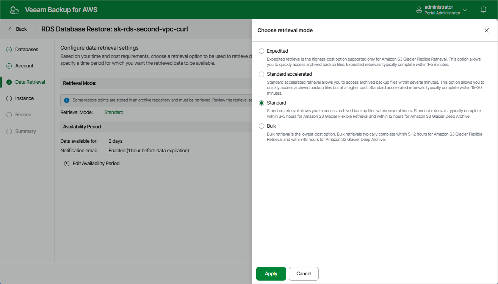

In this article

[This step applies only if you have selected to restore from the archived restore point]

At the Data Retrieval step of the wizard, choose a retrieval mode and specify a period for which you want to keep the data available. To do that:

1. In the Retrieval Mode section, click the link.

1. In the Choose retrieval mode window, choose the retrieval mode that Veeam Backup for AWS will use to retrieve the archived data:

* Expedited — the most expensive option. The retrieved data is available within 1–5 minutes.

Amazon does not support this option for data stored in the S3 Glacier Deep Archive storage class. For more information, see [AWS Documentation](https://docs.aws.amazon.com/prescriptive-guidance/latest/backup-recovery/amazon-s3-glacier.html).

* Standard — the recommended option. The retrieved data is available within 3–5 hours for data stored in the S3 Glacier Flexible Retrieval storage class and within 12 hours for data stored in the S3 Glacier Deep Archive storage class.
* Bulk — the least expensive option. The retrieved data is available within 5–12 hours for data stored in the S3 Glacier Flexible Retrieval storage class and within 48 hours for data stored in the S3 Glacier Deep Archive storage class.

* Standard accelerated — the option that is less expensive than the Expedited option. The retrieved data is available within 15-30 minutes for data stored in the S3 Glacier Flexible Retrieval storage class.

With this option enabled, Veeam Backup for AWS leverages the [S3 Batch Operations functionality](https://docs.aws.amazon.com/AmazonS3/latest/userguide/batch-ops.html) to retrieve the archived data.

|  |
| --- |
| Tip |
| Before you enable the Standard accelerated option, it is recommended that you check whether the IAM role specified to access the archive backup repository has all the permissions required to perform data retrieval operations using the S3 Batch Operations functionality, as described in section [Checking IAM Role Permissions](iam_roles_check.md#check_permissions_iam_role_tab).  If some of the IAM role permissions required to perform data retrieval operations using the S3 Batch Operations functionality are missing, Veeam Backup for AWS will use the Standard option to retrieve data. |

For more information on archive retrieval options, see [AWS Documentation](https://docs.aws.amazon.com/amazonglacier/latest/dev/downloading-an-archive-two-steps.html#api-downloading-an-archive-two-steps-retrieval-options).

1. To save changes made to the data retrieval settings, click Apply.

1. In the Availability Period section, click Edit Availability Period.

1. In the Availability settings window, specify the number of days for which you want to keep the data available for restore operations. If the time period expires while a restore operation is still running, Veeam Backup for AWS automatically extends the period to keep the retrieved data available for 1 more day. You can also [manually extend the availability period](data_retrieval.md#extend) later if required.

If you want to receive an email notification when the data is about to expire, select the Send email notifications check box and specify the number of hours before the expiration time when the notification will be sent.

1. To save changes made to the availability period settings, click Apply.

Page updated 10/2/2025

Page content applies to build 10.0.0.232
