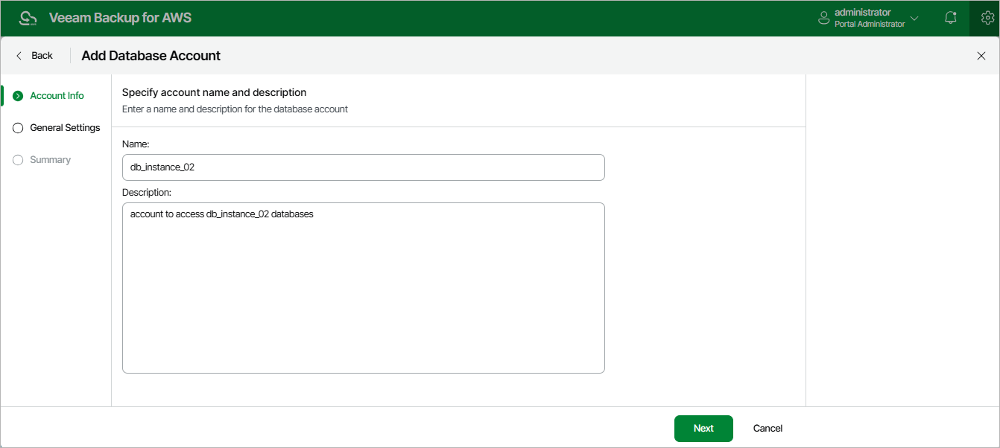

In this article

At the Account Info step of the wizard, use the Name and Description fields to enter a name for the database account and to provide a description for future reference. The name must be unique in Veeam Backup for AWS; the maximum length of the name is 127 characters; the maximum length of the description is 1024 characters.

Page updated 8/20/2025

Page content applies to build 10.0.0.232
