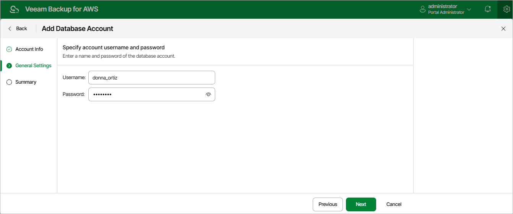

In this article

At the General Settings step of the wizard, specify credentials that the account will use to access databases protected by backup policies.

Page updated 8/20/2025

Page content applies to build 10.0.0.232
