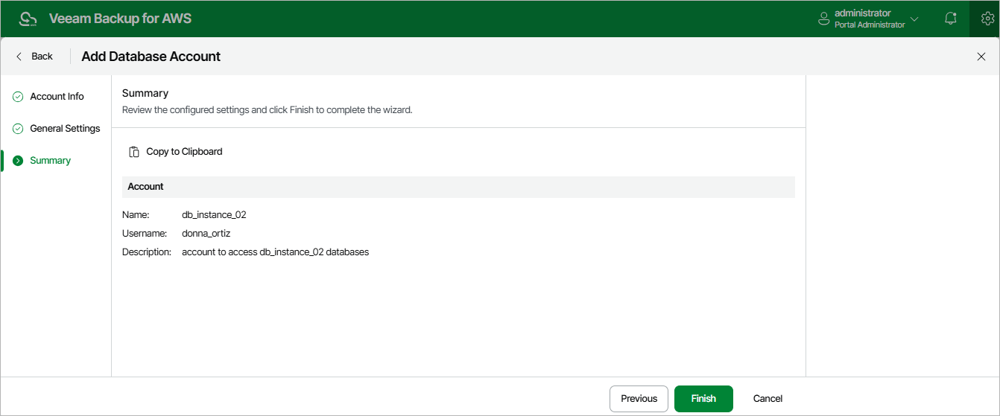

In this article

At the Summary step of the wizard, review summary information and click Finish.

|  |
| --- |
| Tip |
| After you add the database account, you will be able to specify this account while creating backup policies to allow Veeam Backup for AWS to access source databases. For more information, see [Performing RDS Backup](add_policy_processing_settings_rds.md). |

Page updated 8/20/2025

Page content applies to build 10.0.0.232
