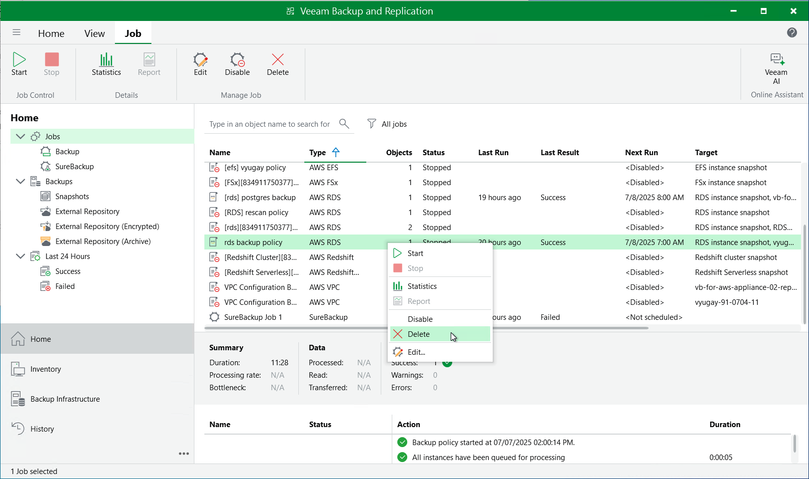

In this article

Veeam Backup & Replication allows you to permanently delete backup policies created by Veeam Backup for AWS.

To delete a backup policy, do the following:

1. In the Veeam Backup & Replication console, open the Home view.
2. Navigate to Jobs.
3. Select the necessary backup policy and click Delete on the ribbon.

Alternatively, you can right-click the necessary backup policy and select Delete.

|  |
| --- |
| Important |
| When you delete a backup policy from Veeam Backup & Replication, the policy is automatically deleted from the backup appliance as well. |

Page updated 7/8/2025

Page content applies to build 10.0.0.232
