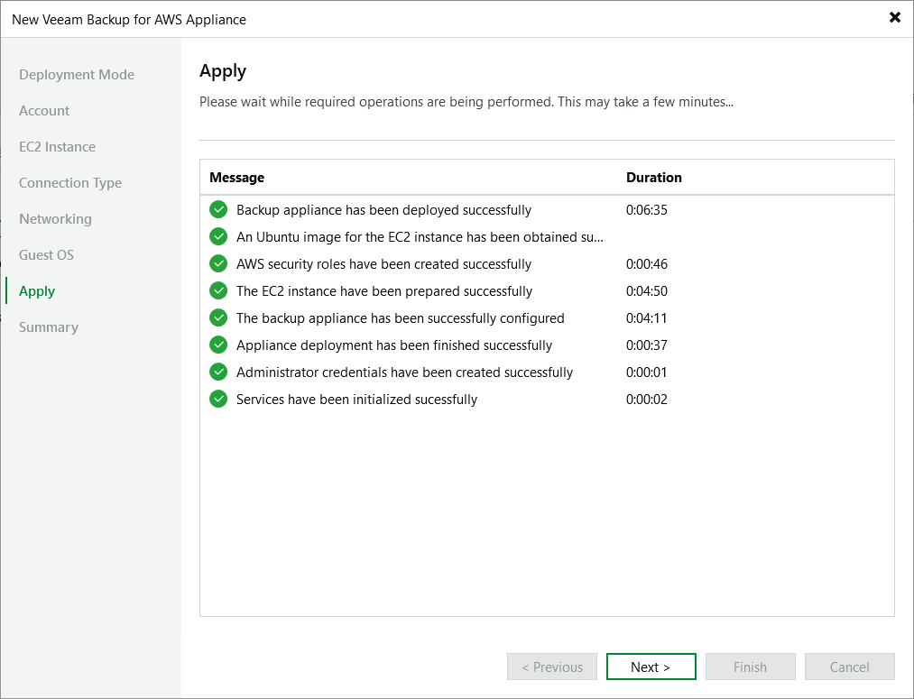

In this article

Veeam Backup & Replication will display the results of every step performed while deploying the backup appliance. At the Apply step of the wizard, wait for the process to complete and click Next.

Page updated 8/11/2025

Page content applies to build 10.0.0.232
