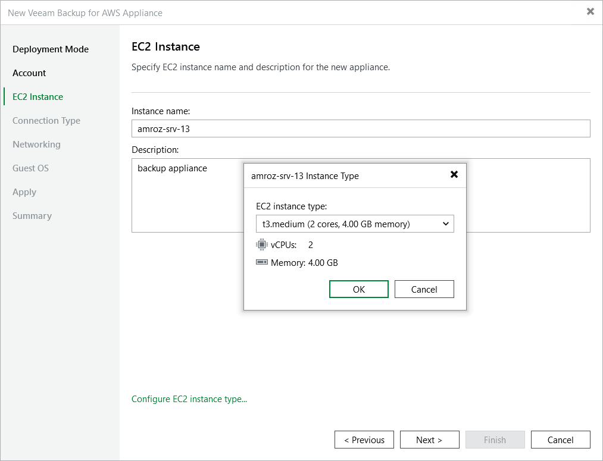

In this article

At the EC2 Instance step of the wizard, specify a name and description for the EC2 instance where Veeam Backup for AWS will be deployed.

|  |
| --- |
| Tip |
| By default, Veeam Backup & Replication uses the minimum recommended t3.medium EC2 instance type for the backup appliance. If you want to choose a specific machine type for the EC2 instance, click Configure EC2 instance type and select the necessary type in the Instance Type window.  For the list of recommended EC2 instance types, see [Sizing and Scalability Guidelines](appliance_aws.md). |

Page updated 8/11/2025

Page content applies to build 10.0.0.232
