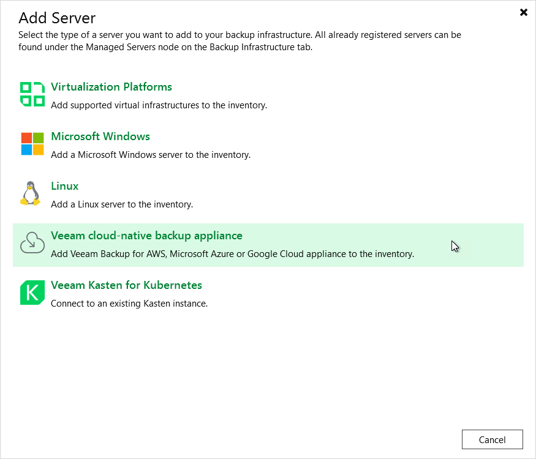

In this article

To launch the New Veeam Backup for AWS Appliance wizard, do one of the following:

1. In the Veeam Backup & Replication console, open the Backup Infrastructure view.
2. Navigate to Managed Servers and click Add Server on the ribbon.

Alternatively, you can right-click the Managed Servers node and select Add Server.

1. In the Add Server window:

1. [Applies only if you have several cloud plug-ins installed] Click Veeam cloud-native backup appliance.
2. Choose Veeam Backup for AWS.

Related Resources

Veeam Backup & Replication User Guide: [Veeam Backup & Replication UI](https://helpcenter.veeam.com/docs/backup/vsphere/vbr_ui.html?ver=120)

Page updated 8/11/2025

Page content applies to build 10.0.0.232
