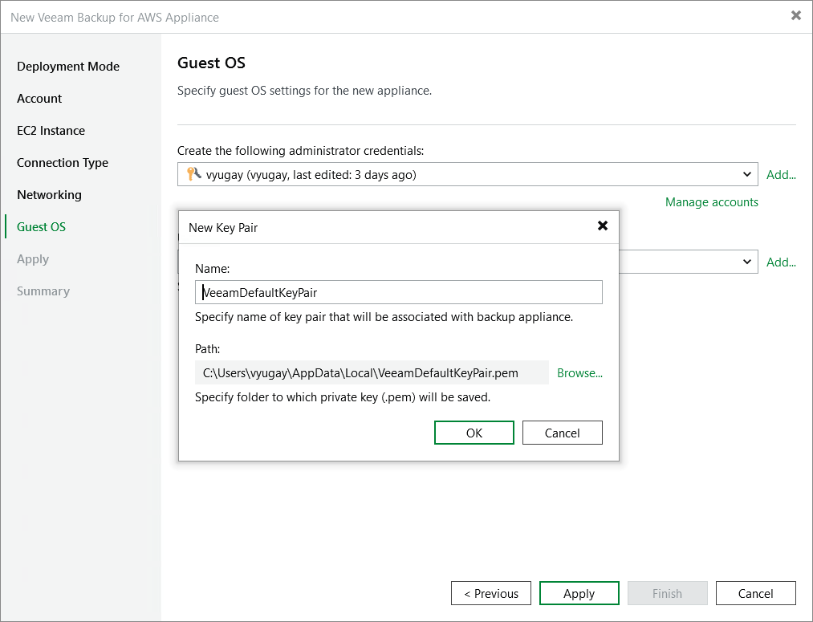

In this article

At the Guest OS step of the wizard, do the following:

1. From the Create the following administrator credentials drop-down list, select a user whose credentials Veeam Backup & Replication will use to create the default user account on the backup appliance.

For a user to be displayed in the Create the following administrator credentials drop-down list, it must be added to the Credentials Manager as described in the Veeam Backup & Replication User Guide, section [Standard Accounts](https://helpcenter.veeam.com/docs/vbr/userguide/credentials_manager_windows.html?ver=13). If you have not added the necessary user to the Credential Manager beforehand, you can do it without closing the New Veeam Backup for AWS Appliance wizard. To do that, click either the Manage accounts link or the Add button, and specify the user name, password and description in the Credentials window.

|  |
| --- |
| Important |
| The specified password must contain at least one special character, one lowercase and one uppercase letters, and must not contain monotonic sequence characters. The password length must be between 8 and 255 characters. |

1. From the Use the following key pair drop-down list, select a key pair that will be used to authenticate against the backup appliance.

For a key pair to be displayed in the list of available keys, it must be created in AWS as described in [AWS Documentation](https://docs.aws.amazon.com/AWSEC2/latest/UserGuide/create-key-pairs.html). If you have not created the necessary key pair beforehand, you can do it without closing the Guest OS wizard. To do that, click Add and specify the private key name and folder path to the key in the New Key Pair window. Veeam Backup & Replication will create a key of the ed25519 type.

Page updated 8/11/2025

Page content applies to build 10.0.0.232
