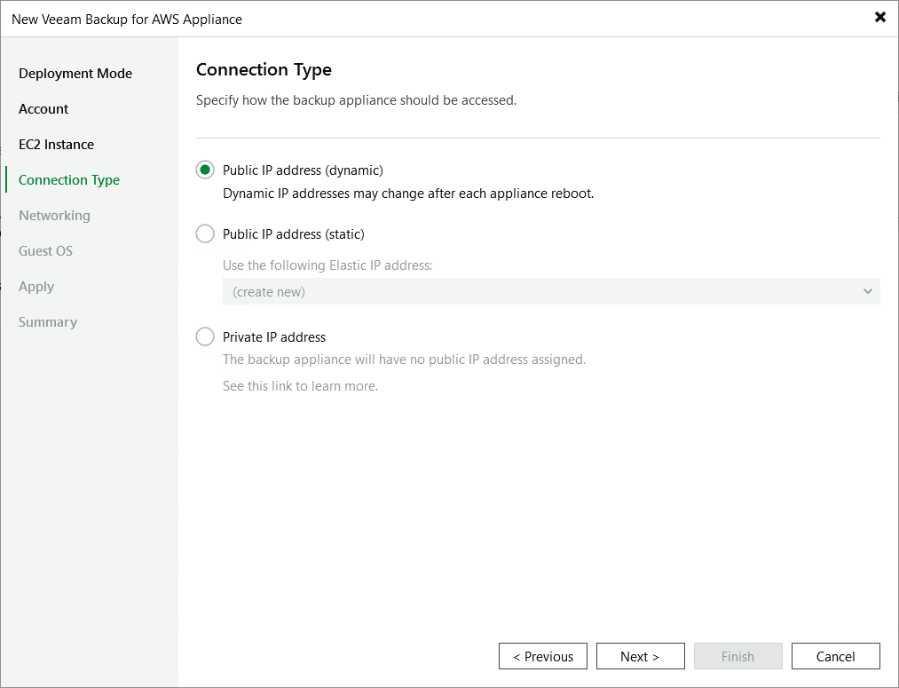

In this article

At the Connection Type step of the wizard, choose whether you want to assign a dynamic or a static (Elastic) public IP address, or a private IP address to the backup appliance. After the backup appliance is deployed, Veeam Backup & Replication will use the specified connection type to connect to the appliance.

To assign an Elastic IP address, you can either reserve a new address or specify an existing one:

* To reserve a new IP address, select the (create new) option from the Use the following address drop-down list.
* To assign an existing IP address, select it from the Use the following address drop-down list.

For an IP address to be displayed in the list of available addresses, it must be allocated to the AWS Region specified at [step 3](deploy_appliance_account.md) of the wizard, as described in [AWS Documentation](https://docs.aws.amazon.com/AWSEC2/latest/UserGuide/elastic-ip-addresses-eip.html#using-instance-addressing-eips-allocating). Note that elastic IP addresses that are used by any other EC2 instances are not displayed in the list.

For more information on Elastic IP addresses, see [AWS Documentation](https://docs.aws.amazon.com/AWSEC2/latest/UserGuide/elastic-ip-addresses-eip.html).

|  |
| --- |
| Notes |
| * If you choose the Private IP address option, you must allow communication between the Veeam Backup & Replication server and the backup appliance. One possible solution is to establish an AWS Site-to-Site VPN connection between the VPC of the appliance and your on-premises network, as described in [Configuring Access to Backup Appliances in AWS](access_backup_appliances.md). * If you choose the Public IP address (static) option, make sure that outbound internet access is allowed from the backup server through port 443 over the HTTPS protocol to <https://checkip.amazonaws.com/> to retrieve the IP address of the backup appliance. |

Page updated 8/11/2025

Page content applies to build 10.0.0.232
