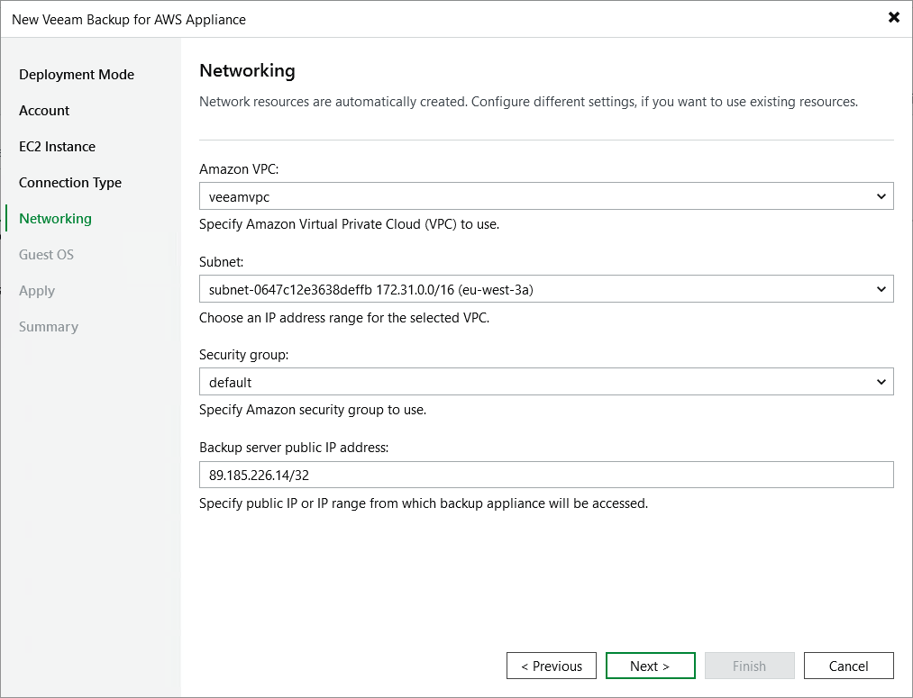

In this article

At the Networking step of the wizard, do the following:

1. Choose an Amazon virtual private cloud (VPC) to which the backup appliance will be connected.

You can create a new VPC or specify an existing one:

* [Applies only if you have selected to assign a public IP address to the backup appliance at the Specify Connection Type step of the wizard] To create a new VPC, select the (create new) option from the Amazon VPC drop-down list. Veeam Backup & Replication will automatically create a virtual network with a set of predefined security group rules.

* To specify an existing VPC, select it from the Amazon VPC drop-down list. For a VPC to be displayed in the list of available networks, it must be created in AWS for the region specified at [step 3](deploy_appliance_account.md) of the wizard, as described in [AWS Documentation](https://docs.aws.amazon.com/vpc/latest/userguide/working-with-vpcs.html).

1. Choose a subnet in which the backup appliance will be launched.

You can create a new subnet or specify an existing one:

* [Applies only if you have selected to assign a public IP address to the backup appliance at the Specify Connection Type step of the wizard] To create a new subnet, select the (create new) option from the Subnet drop-down list. Veeam Backup & Replication will automatically create a subnet in the specified VPC.
* To specify an existing subnet, select it from the Subnet drop-down list. For a subnet to be displayed in the list of available subnets, it must be created in the specified VPC as described in [AWS Documentation](https://docs.aws.amazon.com/vpc/latest/userguide/working-with-vpcs.html).

|  |
| --- |
| Important |
| * The specified Amazon VPC and subnet must have the outbound internet access to AWS services listed in section [AWS Services](system_requirements_aws_services.md).  * The specified Amazon VPC and subnet must allow inbound internet access from both the backup server and a local machine that you plan to use to work with Veeam Backup for AWS.   To learn how to enable internet access for Amazon VPCs and subnets, see [AWS Documentation](https://docs.aws.amazon.com/vpc/latest/userguide/VPC_Internet_Gateway.html#vpc-igw-internet-access). |

1. Choose a security group that will be associated with the backup appliance.

You can create a new security group or specify an existing one:

* [Applies only if you have selected to assign a public IP address to the backup appliance at the Specify Connection Type step of the wizard] To create a new security group, select the (create new) option from the Security group drop-down list. Veeam Backup & Replication will automatically create a group.
* To specify an existing security group, select it from the Security group drop-down list. For a security group to be displayed in the list of available groups, it must be created in AWS as described in [AWS Documentation](https://docs.aws.amazon.com/vpc/latest/userguide/VPC_SecurityGroups.html#WorkingWithSecurityGroups).

|  |
| --- |
| Important |
| If you select an existing security group, consider that security group rules must allow inbound internet access from both the backup server and a local machine that you plan to use to work with Veeam Backup for AWS. To learn how to create security group rules, see [AWS Documentation](https://docs.aws.amazon.com/vpc/latest/userguide/VPC_SecurityGroups.html#creating-security-groups). |

1. [Applies only if you have selected to assign a public IP address to the backup appliance at the Specify Connection Type step of the wizard] In the Backup server public IP address field, specify an IP address or a range of IP addresses that will be allowed to access the backup appliance.

* If you have chosen to create a new security group, Veeam Backup & Replication will create a security rule for the specified IP address ranges. Note that the backup server IP address must fall into the specified IP address range.
* If you have chosen to specify an existing security group, Veeam Backup & Replication will verify whether the security group allows inbound HTTPS traffic (port 443) from the specified IP addresses. If the security group restricts inbound HTTPS traffic, you will not be able to proceed with the wizard.

1. [Applies only if you have selected to assign a private IP address to the backup appliance at the Specify Connection Type step of the wizard] In the Backup server IP address field, specify an IP address or a range of IP addresses that will be allowed to access the backup appliance. Note that the backup server IP address must fall into the specified IP address range.

Veeam Backup & Replication will verify whether the specified security group allows inbound HTTPS traffic (port 443) from the specified IP addresses. If the security group restricts inbound HTTPS traffic, you will not be able to proceed with the wizard.

|  |
| --- |
| Tip |
| The IPv4 address ranges must be specified in the CIDR notation (for example, 12.23.34.0/24). To specify multiple IP addresses or multiple IP address ranges, use a comma-separated list. |

Page updated 8/11/2025

Page content applies to build 10.0.0.232
