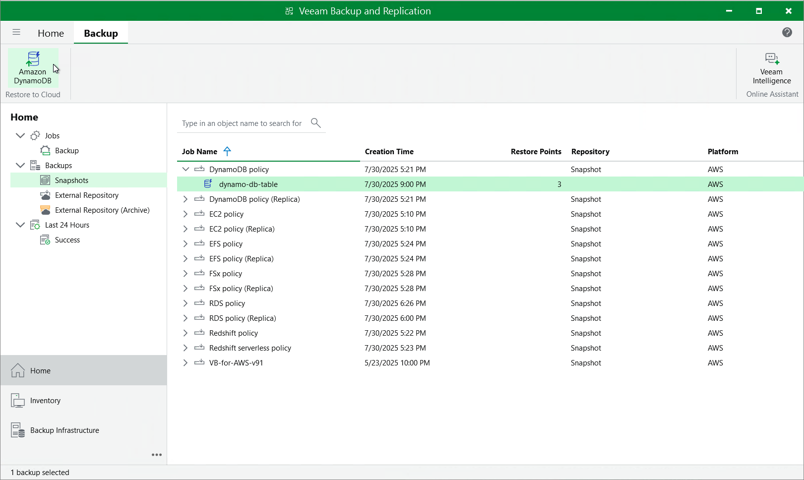

In this article

You can recover corrupted DynamoDB tables in the Veeam Backup for AWS Web UI only. However, you can launch the DynamoDB Table Restore wizard directly from the Veeam Backup & Replication console to start the restore operation:

1. In the Veeam Backup & Replication console, open the Home view.
2. Navigate to Backups > Snapshots.
3. Expand the backup policy that protects the DynamoDB tables you want to recover, select the necessary table and click Amazon DynamoDB on the ribbon.

Alternatively, you can right-click the selected table and click Restore to Amazon DynamoDB.

|  |
| --- |
| Important |
| You cannot restore multiple DynamoDB tables from the Veeam Backup & Replication console. |

Veeam Backup & Replication will open the DynamoDB Table Restore wizard in a web browser. Complete the wizard as described in section [DynamoDB Restore Using Web UI](restore_point_dynamo.md).

Page updated 10/8/2025

Page content applies to build 10.0.0.232
