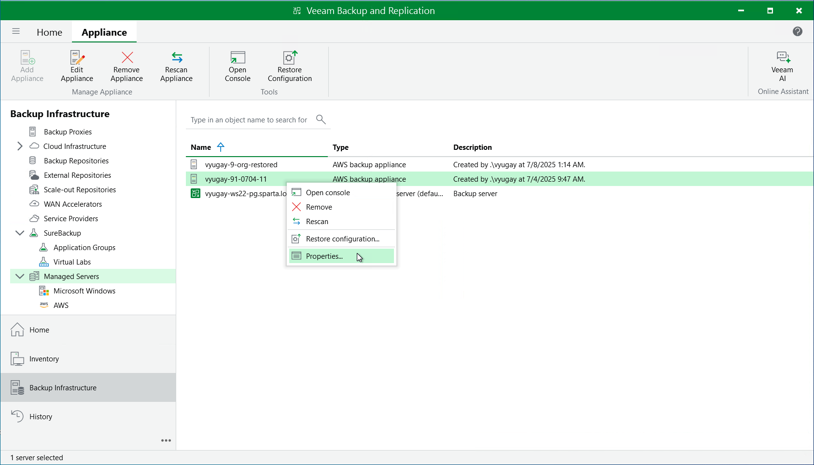

In this article

For each backup appliance managed by the backup server, you can modify the settings configured while adding the appliance to the backup infrastructure:

1. In the Veeam Backup & Replication console, open the Backup Infrastructure view.
2. Navigate to Managed Servers.
3. Select the necessary backup appliance and click Edit Appliance on the ribbon.

Alternatively, you can right-click the appliance and select Properties.

1. Complete the Edit Veeam Backup for Veeam Backup for AWS Appliance wizard:

1. To change the access keys of an IAM user that are used to connect to the backup appliance, follow the instructions provided in section [Connecting to Existing Veeam Backup for AWS Appliances](connect_appliance_launch.md) (step 1).
2. To provide a new description for the backup appliance, follow the instructions provided in section [Connecting to Existing Veeam Backup for AWS Appliances](connect_appliance_instance.md) (step 4).
3. To change the way Veeam Backup & Replication connects to the backup appliance, follow the instructions provided in section [Connecting to Existing Veeam Backup for AWS Appliances](connect_appliance_connection.md) (step 5).

|  |
| --- |
| Important |
| You cannot change the way Veeam Backup & Replication connects to a backup appliance deployed in a private environment. |

1. To change the user whose credentials Veeam Backup & Replication uses to connect to the backup appliance, follow the instructions provided in section [Connecting to Existing Veeam Backup for AWS Appliances](connect_appliance_creds.md) (step 6).
2. To accept the newly created self-signed certificate, follow the instructions provided in section [Connecting to Existing Appliances](connect_appliance_warnings.md#certificate) (step 6).
3. To edit settings of the backup appliance repositories added to the backup infrastructure, follow the instructions provided in section [Connecting to Existing Veeam Backup for AWS Appliances](connect_appliance_repo.md) (step 7).
4. At the Apply step of the wizard, wait for the changes to be applied and click Next.
5. At the Summary step of the wizard, review summary information and click Finish to confirm the changes.

Page updated 11/7/2025

Page content applies to build 10.0.0.232
